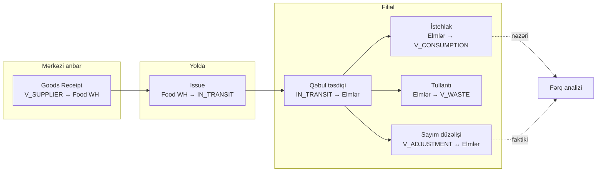
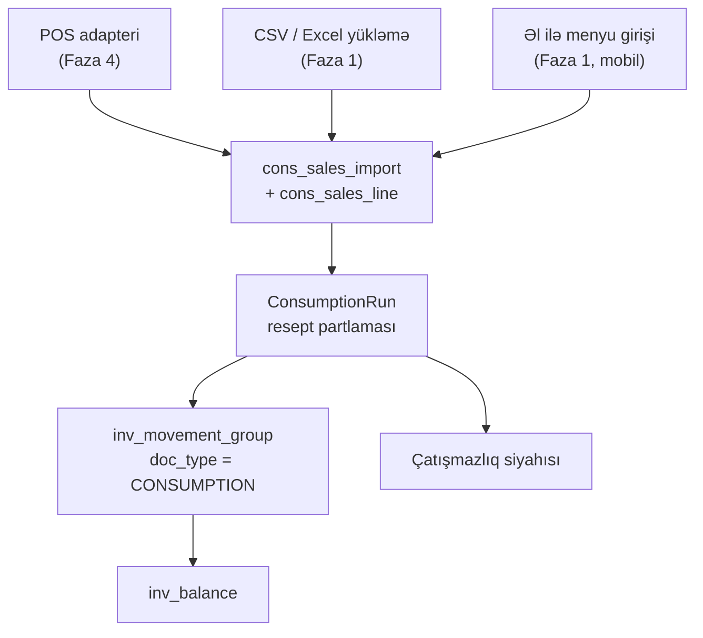
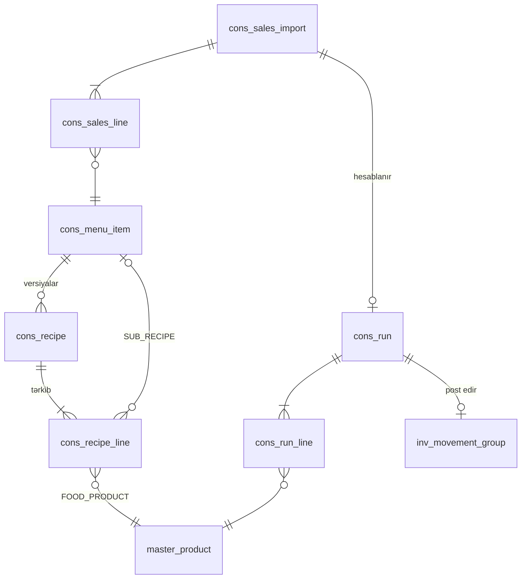

# Filial əməliyyatları — domen dizaynı

**Status:** Layihələndirilib 21.09.2026 · Qərar: [ADR-012](../adr/ADR-012-branch-consumption-model.md)
**Modul:** `Consumption` (`cons` şeması) · `--Modules=consumption`

Bu sənəd filial (restoran) tərəfinin bütöv mənzərəsini verir: malın filiala necə
gəldiyini, orada necə işləndiyini və fərqin necə ölçüldüyünü.

---

## 1. Filialda malın tam dövrü



Hər ox bir `movement_group`-dur və cəmi sıfıra bərabərdir (ADR-003). İstehlak bu
zəncirdə **çatışmayan həlqə idi**; ADR-012 onu bağlayır.

---

## 2. Satış məlumatının üç mənbəyi, bir giriş nöqtəsi



Mənbə fərqi yalnız `cons_sales_import.source` sahəsindədir. Aşağı axın eynidir —
POS inteqrasiyası gecikərsə sistem işləməyə davam edir.

---

## 3. Resept partlaması (BOM explosion)

Bir menyu maddəsinin satışı inqrediyent miqdarına belə çevrilir:

```
tələb olunan_base = satılan_porsiya
                  × sətir.qty_per_portion
                  × sətir.conversion_to_base
                  ÷ (sətir.yield_pct / 100)
```

`yield_pct` emal itkisini modelləşdirir: kahının 8 %-i kəsilib atılırsa `yield_pct = 92`
və reseptdə 20 q kahı yazılıbsa stokdan 21,74 q çıxır. Bu əmsal olmadan nəzəri rəqəm
həmişə faktiki rəqəmdən az çıxır və fərq analizi mənasını itirir.

**Alt-reseptlər.** Filialda hazırlanan yarımfabrikat (məsələn qarışdırılan sous) öz
resepti olan bir maddədir. `cons_recipe_line.component_type = 'SUB_RECIPE'` olduqda
mühərrik rekursiv açılır. Dövr (`A → B → A`) aşkarlanıb rədd edilir; maksimum
dərinlik 5-dir.

**Versiyalama.** Hesablama **satış tarixinə** aid resept versiyasını götürür, cari
versiyanı yox. Resept dəyişdikdə köhnə sətir `valid_to` ilə bağlanır, yeni sətir açılır —
`master_product_uom`-dakı qayda ilə eyni. Keçmiş hesablamalar heç vaxt dəyişmir.



---

## 4. Cədvəllər

```sql
-- Menyu maddəsi (satılan şey). Məhsul deyil — məhsul inqrediyentdir.
CREATE TABLE cons_menu_item (
  id            INT UNSIGNED PRIMARY KEY AUTO_INCREMENT,
  tenant_id     INT UNSIGNED NOT NULL,
  code          VARCHAR(48)  NOT NULL,        -- daxili kod
  pos_code      VARCHAR(64)  NULL,            -- POS-dakı kod; import bununla tapır
  name          VARCHAR(250) NOT NULL,
  name_sort_key VARCHAR(250) NOT NULL,
  category      VARCHAR(120) NULL,            -- Sandwich, Salad, Drink, Cookie
  is_sub_recipe TINYINT(1) NOT NULL DEFAULT 0, -- filialda hazırlanan yarımfabrikat
  is_active     TINYINT(1) NOT NULL DEFAULT 1,
  created_at    DATETIME(3) NOT NULL,
  created_by    INT UNSIGNED NOT NULL,
  updated_at    DATETIME(3) NULL,
  updated_by    INT UNSIGNED NULL,
  row_version   INT UNSIGNED NOT NULL DEFAULT 1,
  is_deleted    TINYINT(1) NOT NULL DEFAULT 0,
  UNIQUE KEY uq_menu_code (tenant_id, code),
  UNIQUE KEY uq_menu_pos  (tenant_id, pos_code),
  KEY ix_menu_name (tenant_id, name_sort_key)
) ENGINE=InnoDB;

-- Resept versiyası. Hesablama satış tarixinə düşən versiyanı götürür.
CREATE TABLE cons_recipe (
  id            INT UNSIGNED PRIMARY KEY AUTO_INCREMENT,
  tenant_id     INT UNSIGNED NOT NULL,
  menu_item_id  INT UNSIGNED NOT NULL,
  version_no    SMALLINT UNSIGNED NOT NULL,
  yield_portions DECIMAL(18,4) NOT NULL DEFAULT 1.0000,  -- 1 hazırlanışdan çıxan porsiya
  status        ENUM('DRAFT','ACTIVE','ARCHIVED') NOT NULL DEFAULT 'DRAFT',
  valid_from    DATE NOT NULL,
  valid_to      DATE NULL,                    -- yeni versiya açılanda doldurulur
  note          VARCHAR(1000) NULL,
  created_at    DATETIME(3) NOT NULL,
  created_by    INT UNSIGNED NOT NULL,
  row_version   INT UNSIGNED NOT NULL DEFAULT 1,
  UNIQUE KEY uq_recipe_ver (tenant_id, menu_item_id, version_no),
  KEY ix_recipe_eff (tenant_id, menu_item_id, valid_from, valid_to)
) ENGINE=InnoDB;

CREATE TABLE cons_recipe_line (
  id              INT UNSIGNED PRIMARY KEY AUTO_INCREMENT,
  tenant_id       INT UNSIGNED NOT NULL,
  recipe_id       INT UNSIGNED NOT NULL,
  line_no         SMALLINT UNSIGNED NOT NULL,
  component_type  ENUM('FOOD_PRODUCT','SUB_RECIPE') NOT NULL,
  product_id      INT UNSIGNED NULL,          -- FOOD_PRODUCT olduqda
  sub_menu_item_id INT UNSIGNED NULL,         -- SUB_RECIPE olduqda
  qty_per_portion DECIMAL(18,4) NOT NULL,
  uom_id          SMALLINT UNSIGNED NOT NULL,
  yield_pct       DECIMAL(9,4) NOT NULL DEFAULT 100.0000,  -- emal itkisi
  is_optional     TINYINT(1) NOT NULL DEFAULT 0,           -- müştəri istəyi ilə
  attach_rate_pct DECIMAL(9,4) NOT NULL DEFAULT 100.0000,  -- opsional tərkibin götürülmə faizi
  UNIQUE KEY uq_rline (recipe_id, line_no)
) ENGINE=InnoDB;

-- Bir filialın bir günlük satışı. Mənbədən asılı olmayaraq eyni forma.
CREATE TABLE cons_sales_import (
  id            BIGINT UNSIGNED PRIMARY KEY AUTO_INCREMENT,
  tenant_id     INT UNSIGNED NOT NULL,
  location_id   INT UNSIGNED NOT NULL,
  business_date DATE NOT NULL,
  source        ENUM('POS','CSV','MANUAL') NOT NULL,
  external_ref  VARCHAR(120) NULL,            -- POS batch/smena nömrəsi
  status        ENUM('DRAFT','SUBMITTED','CONSUMED','CANCELLED') NOT NULL DEFAULT 'DRAFT',
  line_count    SMALLINT UNSIGNED NOT NULL DEFAULT 0,
  gross_amount  DECIMAL(18,4) NULL,
  imported_at   DATETIME(3) NOT NULL,
  imported_by   INT UNSIGNED NOT NULL,
  row_version   INT UNSIGNED NOT NULL DEFAULT 1,
  UNIQUE KEY uq_sales_day (tenant_id, location_id, business_date),
  KEY ix_sales_status (tenant_id, status, business_date)
) ENGINE=InnoDB;

CREATE TABLE cons_sales_line (
  id            BIGINT UNSIGNED PRIMARY KEY AUTO_INCREMENT,
  tenant_id     INT UNSIGNED NOT NULL,
  import_id     BIGINT UNSIGNED NOT NULL,
  menu_item_id  INT UNSIGNED NULL,            -- tanınmayan POS kodunda NULL
  raw_pos_code  VARCHAR(64) NULL,             -- tanınmadıqda saxlanılır
  qty_sold      DECIMAL(18,4) NOT NULL,
  gross_amount  DECIMAL(18,4) NULL,
  UNIQUE KEY uq_sline (import_id, menu_item_id, raw_pos_code)
) ENGINE=InnoDB;

-- Bir filialın bir günlük nəzəri məxarici.
CREATE TABLE cons_run (
  id            BIGINT UNSIGNED PRIMARY KEY AUTO_INCREMENT,
  tenant_id     INT UNSIGNED NOT NULL,
  doc_no        VARCHAR(32) NOT NULL,         -- CN-2026-00042
  location_id   INT UNSIGNED NOT NULL,
  business_date DATE NOT NULL,
  import_id     BIGINT UNSIGNED NOT NULL,
  status        ENUM('DRAFT','CALCULATED','POSTED','FAILED','REVERSED') NOT NULL DEFAULT 'DRAFT',
  movement_group_id BIGINT UNSIGNED NULL,
  shortfall_count   SMALLINT UNSIGNED NOT NULL DEFAULT 0,
  unmapped_count    SMALLINT UNSIGNED NOT NULL DEFAULT 0,  -- resepti tapılmayan satış
  calculated_at DATETIME(3) NULL,
  posted_at     DATETIME(3) NULL,
  posted_by     INT UNSIGNED NULL,
  row_version   INT UNSIGNED NOT NULL DEFAULT 1,
  UNIQUE KEY uq_run_doc (tenant_id, doc_no),
  UNIQUE KEY uq_run_day (tenant_id, location_id, business_date),
  KEY ix_run_status (tenant_id, status, business_date)
) ENGINE=InnoDB;

CREATE TABLE cons_run_line (
  id                 BIGINT UNSIGNED PRIMARY KEY AUTO_INCREMENT,
  tenant_id          INT UNSIGNED NOT NULL,
  run_id             BIGINT UNSIGNED NOT NULL,
  product_id         INT UNSIGNED NOT NULL,
  theoretical_qty_base DECIMAL(18,4) NOT NULL,   -- resept partlamasının nəticəsi
  posted_qty_base      DECIMAL(18,4) NOT NULL,   -- faktiki çıxarılan (qalıq qədər)
  shortfall_qty_base   DECIMAL(18,4) NOT NULL DEFAULT 0,
  base_uom_id        SMALLINT UNSIGNED NOT NULL,
  unit_cost          DECIMAL(18,4) NULL,
  UNIQUE KEY uq_rl (run_id, product_id)
) ENGINE=InnoDB;
```

**`master_location.location_type`** ENUM-una `V_CONSUMPTION` əlavə olunur.
**`inv_movement_group.doc_type`** ENUM-una `CONSUMPTION` əlavə olunur.
**Sənəd nömrəsi:** `CN-{YYYY}-{00000}`, `master_number_sequence`-dən.

---

## 5. Hesablama axını

```mermaid
sequenceDiagram
  participant J as ConsumptionRunner (job)
  participant C as Consumption
  participant M as MasterData
  participant I as Inventory
  participant DB as MySQL

  J->>C: Run(location, businessDate)
  C->>DB: SELECT sales_import + lines
  C->>C: hər satış sətri → resept versiyası (business_date)
  C->>C: rekursiv BOM partlaması (dərinlik ≤ 5, dövr yoxlanışı)
  C->>M: GetUomFactor(product, uom, businessDate)
  C->>C: məhsul üzrə cəm → cons_run_line.theoretical_qty_base
  C->>I: GetAvailable(location, products)
  I-->>C: qalıqlar
  C->>C: posted = min(theoretical, available); shortfall = fərq
  C->>I: PostConsumption(group: location −posted / V_CONSUMPTION +posted)
  I->>DB: FOR UPDATE balans → movement → balance → outbox (bir tranzaksiya)
  I-->>C: movement_group_id
  C->>DB: run.status = POSTED
  C->>DB: outbox: ConsumptionPosted (+ ConsumptionShortfallDetected varsa)
```

**Vacib detal:** partiya seçimi avtomatikdir və `master_product.issue_strategy`
(FEFO/FIFO) qaydasına tabedir — bu, arxa fon işidir, istifadəçi partiya seçmir.
Bloklanmış və vaxtı keçmiş partiyalar ayırmaya daxil edilmir; onlara görə çatışmazlıq
yaranırsa bu, expiry prosesinin işlədiyinin göstəricisidir və ayrıca siqnaldır.

---

## 6. İnvariantlar

Hər biri üçün ayrıca test tələb olunur:

1. **Sıfır cəmi.** `CONSUMPTION` qrupu da ikili yazılışdır: `SUM(qty_base) = 0`.
2. **Bir gün, bir sənəd.** `(tenant_id, location_id, business_date)` üzrə unikal.
   Təkrar import yeni sənəd yaratmır; düzəliş yalnız `REVERSAL` ilə.
3. **Mənfi qalıq yaranmır.** `posted_qty_base = min(theoretical, available)`.
   Qalan hissə `shortfall_qty_base` kimi qeyd olunur, gizlədilmir.
4. **Keçmiş toxunulmazdır.** Hesablama satış tarixinin resept versiyasını və həmin
   andakı conversion əmsalını götürür; hər ikisi `inv_movement`-də dondurulur.
5. **Tanınmayan satış itmir.** Resepti olmayan menyu maddəsi `unmapped_count`-a düşür
   və `raw_pos_code` ilə saxlanılır — səssizcə atılmır.
6. **Dövr rədd edilir.** Alt-resept dövrü aşkarlansa hesablama `422` ilə dayanır.
7. **Sayım dondurulmasına tabedir.** `inv_count.status = FROZEN` olan lokasiyada
   istehlak post edilmir (`409 LOCATION_FROZEN`), növbəti işə salınmada təkrarlanır.

---

## 7. Fərq analizi — modelin əsl məhsulu

İki sayım arasındakı dövr üçün, məhsul və lokasiya üzrə:

```
gözlənilən_son_qalıq = əvvəlki_sayım
                     + qəbullar
                     − nəzəri_istehlak
                     − qeydə_alınmış_tullantı
                     − nümunə
                     ± transferlər

fərq = faktiki_sayım − gözlənilən_son_qalıq
fərq_dəyəri = fərq × avg_unit_cost
```

Bu rəqəm menecerin əsas alətidir. Mənfi fərq üç səbəbdən olur: porsiya normadan
böyükdür, tullantı qeyd olunmayıb, yaxud mal itib. Hesabat üçüncüsünü sübut etmir,
lakin ilk ikisini istisna etməklə sualı kəskinləşdirir.

`Reporting` modulunda iki yeni hesabat: **«Nəzəri vs faktiki istehlak»** (məhsul ×
filial × dövr) və **«Porsiya uyğunluğu»** (menyu maddəsi üzrə bir porsiyaya düşən
faktiki sərfiyyat, reseptlə müqayisədə).

---

## 8. İcazələr, hadisələr, job-lar

| İcazə | Təsir |
|---|---|
| `cons.recipe.manage` | Resept yaratmaq və versiyalamaq (menecer) |
| `cons.recipe.view` | Reseptə baxmaq |
| `cons.sales.import` | Satış məlumatı yükləmək (filial + menecer) |
| `cons.run.calculate` | Nəzəri məxarici hesablamaq |
| `cons.run.post` | Sənədi post etmək |
| `cons.variance.view` | Fərq hesabatı |

| Hadisə | Nə vaxt | Consumer |
|---|---|---|
| `SalesImported` | Satış qəbul edildikdə | Consumption, Reporting |
| `ConsumptionPosted` | Sənəd post edildikdə | Reporting, Notification, Integration |
| `ConsumptionShortfallDetected` | Qalıq çatmadıqda | Notification (filial + menecer) |
| `SalesItemUnmapped` | Resepti olmayan satış | Notification (menecer) |

| Job | Cədvəl | İş |
|---|---|---|
| `ConsumptionRunner` | gündəlik 03:00 | Əvvəlki iş günü üçün hər filialda hesablama və post |
| `SalesImportReminder` | gündəlik 11:00 | Dünənin satışı yüklənməyibsə filiala xatırlatma |

`ConsumptionRunner` səhər 02:00 və 02:10-dakı özünüyoxlama job-larından **sonra**
işləyir ki, balans uyğunsuzluğu varsa istehlak onun üstünə yazılmasın.

---

## 9. Filial tərəfinin ekranları

**Mobil (BRANCH_USER) — əsas iş yeri.**

| Ekran | Məqsəd | Komponentlər |
|---|---|---|
| Günün satışı | POS yoxdursa menyu maddələri üzrə satılan sayı daxil etmək | `WmsQtyUomInput`, `WmsDataTable` |
| İstehlak nəticəsi | Dünənki nəzəri məxaric və çatışmazlıqlar | `WmsLedgerTable`, `WmsAlert` |
| Gələn mal | `IN_TRANSIT` təsdiqi, fərqlə | `WmsQtyUomInput`, `WmsDocStatusBadge` |
| Tələb | Mərkəzi anbardan mal istəmək | `WmsDataTable`, `WmsQtyUomInput` |
| Tullantı | Səbəb kodu + foto | `WmsBatchPicker`, `WmsSelect` |
| Sayım | Dondurulmuş qalıq vs sayılan | `WmsVarianceIndicator` |
| Qalıq | Öz filialının stoku | `WmsDataTable` |

**Veb (menecer).**

| Ekran | Məqsəd |
|---|---|
| Resept kataloqu | Menyu maddələri, versiyalar, tərkib, itki faizi |
| Resept redaktoru | Versiya açmaq, alt-resept bağlamaq, dövr yoxlanışı |
| Satış importu | CSV yükləmə, POS batch statusu, tanınmayan kodlar |
| İstehlak jurnalı | Filial × gün, çatışmazlıqlar |
| Fərq hesabatı | Nəzəri vs faktiki, manatla dəyər |

Qiymət və maya dəyəri sahələri yenə `master.product.view_cost` icazəsinə bağlıdır —
filial istifadəçisi porsiya sərfiyyatını görür, manatla dəyərini görmür.

---

## 10. Mərhələlər

| Faza | Nə işləyir |
|---|---|
| **1a** | Resept master-i, `MANUAL` satış girişi, hesablama, post, çatışmazlıq siqnalı |
| **1b** | CSV import, tanınmayan kod idarəetməsi |
| **3** | Fərq hesabatları, porsiya uyğunluğu, menyu mühəndisliyi |
| **4** | POS adapteri — eyni giriş nöqtəsinə qoşulur, aşağı axın dəyişmir |

Faza 0-a əlavə olunan iş: **menyu maddələrinin siyahısı, hər biri üçün resept, porsiya
miqdarı və emal itkisi faizi.** Bu, müştərinin əməliyyat komandasından vaxt tələb edir
və layihə planında ayrıca sətir olmalıdır.
