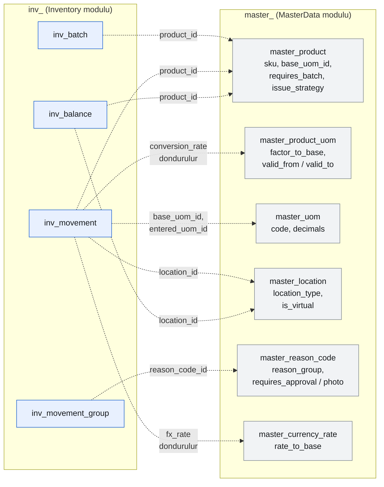
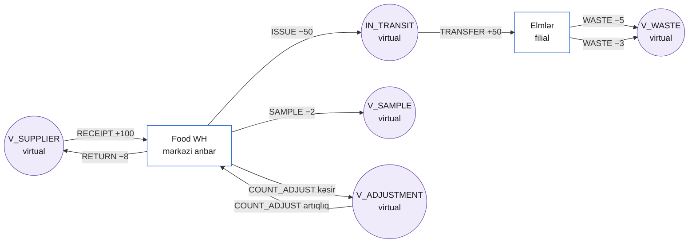
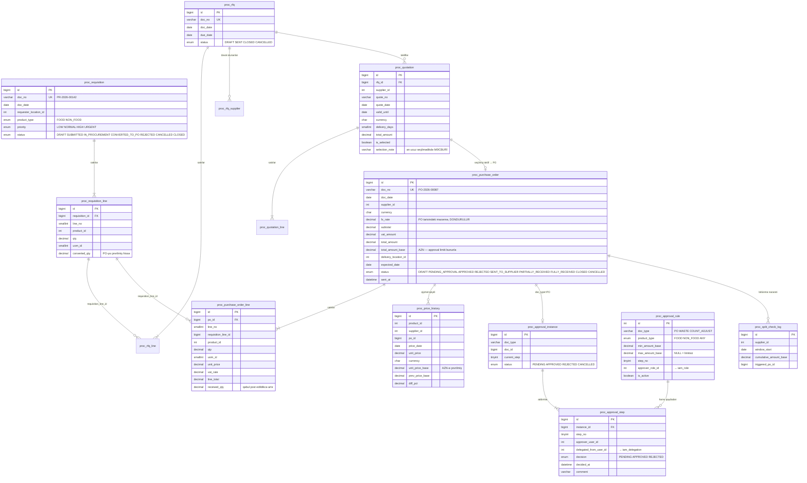
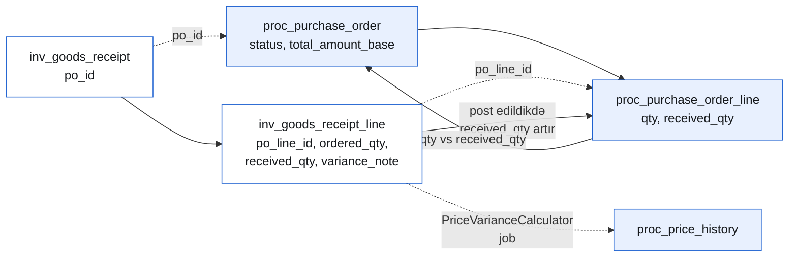
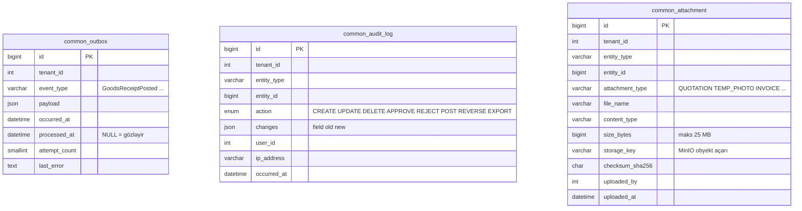

# Data modeli

Bu sənəd `inv` (nüvə) və `proc` cədvəllərinin əlaqələrini və ikili yazılışın
cədvəl formasını göstərir. **Mənbə — [SPEC §9](../SPEC-Satinalma-Anbar-Platformasi.md#9-şema-inv--nüvə)
və [§10](../SPEC-Satinalma-Anbar-Platformasi.md#10-şema-proc)**; buradakı diaqramlar onların
oxunaqlı təsviridir, DDL deyil. Ziddiyyət olarsa SPEC üstündür.

## Oxumadan əvvəl bilinməli qaydalar

| Qayda | Mənbə |
|---|---|
| Cədvəl adı `<prefiks>_<ad>`, tək halda, `snake_case`. MySQL-də ayrı şema yoxdur — tək `wms` database + prefiks. | [ADR-010](../adr/ADR-010-mysql-single-db-table-prefix.md), SPEC §6.1 |
| Hər cədvəldə `tenant_id`, `created_at/by`, `updated_at/by`, `row_version`, `is_deleted` (ledger-də `is_deleted` YOXDUR). | SPEC §6.2 |
| **Hər unikal indeksin birinci sütunu `tenant_id`.** | SPEC §6.5 |
| Miqdar/məbləğ `DECIMAL(18,4)`, əmsal/məzənnə `DECIMAL(18,8)`, faiz `DECIMAL(9,4)`. `FLOAT`/`DOUBLE` qadağandır. | SPEC §6.3, [ADR-008](../adr/ADR-008-decimal-on-client.md) |
| **Şemalararası FOREIGN KEY yoxdur.** Diaqramdakı punktir əlaqələr məntiqi istinaddır (sütun var, FK yoxdur). | SPEC §5 |
| `inv_movement` append-only: `UPDATE`/`DELETE` qadağandır, DB hüquqları ilə də tətbiq olunur. | SPEC §9.4, §16 |
| `inv_balance` törəmədir, birbaşa yazılmır. | [ADR-004](../adr/ADR-004-balance-as-projection.md) |

---

## 1. `inv` nüvəsi — partiya, ledger, balans

Sənədlər (qəbul, məxaric, sayım, tullantı, nümunə, qaytarma) **ledger-ə sahib deyil**:
onlar post edildikdə bir `inv_movement_group` yaradır və ona `movement_group_id` ilə istinad edir.

```mermaid
erDiagram
    inv_batch ||--o{ inv_movement : "partiya"
    inv_batch ||--o{ inv_balance : "partiya qalığı"
    inv_movement_group ||--|{ inv_movement : "sətirlər, SUM(qty_base)=0"
    inv_movement_group ||--o| inv_movement_group : "reverses_group_id (storno)"
    inv_movement }o--|| inv_balance : "proyeksiyanı yeniləyir"

    inv_goods_receipt ||--|{ inv_goods_receipt_line : "sətirlər"
    inv_goods_receipt o|--|| inv_movement_group : "movement_group_id (POSTED)"

    inv_stock_request ||--|{ inv_stock_request_line : "sətirlər"
    inv_stock_request ||--o{ inv_issue : "request_id"
    inv_issue ||--|{ inv_issue_line : "sətirlər"
    inv_issue o|--|| inv_movement_group : "dispatch_group_id"
    inv_issue o|--|| inv_movement_group : "receipt_group_id"

    inv_count ||--|{ inv_count_line : "sətirlər"
    inv_count o|--|| inv_movement_group : "adjust_group_id"

    inv_waste ||--|{ inv_waste_line : "sətirlər"
    inv_waste o|--|| inv_movement_group : "movement_group_id"

    inv_sample ||--|{ inv_sample_line : "sətirlər"
    inv_sample o|--|| inv_movement_group : "movement_group_id"

    inv_return_to_vendor ||--|{ inv_return_to_vendor_line : "sətirlər"
    inv_return_to_vendor o|--|| inv_movement_group : "movement_group_id"
    inv_goods_receipt ||--o{ inv_return_to_vendor : "receipt_id"

    inv_batch {
        bigint id PK
        int tenant_id
        int product_id "→ master_product (FK YOX)"
        varchar batch_no
        date production_date
        date expiry_date
        int supplier_id "→ master_supplier"
        datetime received_at "FIFO sırası"
        enum status "ACTIVE BLOCKED EXPIRED QUARANTINE"
    }

    inv_movement_group {
        bigint id PK
        int tenant_id
        enum doc_type "RECEIPT ISSUE TRANSFER COUNT_ADJUST WASTE SAMPLE RETURN OPENING REVERSAL"
        varchar doc_no UK
        date doc_date
        varchar source_doc_type "PO STOCK_REQUEST COUNT ..."
        bigint source_doc_id
        smallint reason_code_id "→ master_reason_code"
        bigint reverses_group_id "storno mənbəyi"
        datetime posted_at
        int posted_by
        char idempotency_key UK
    }

    inv_movement {
        bigint id PK
        int tenant_id
        bigint group_id FK
        smallint line_no
        int product_id
        bigint batch_id
        int location_id "→ master_location"
        decimal qty_base "IŞARƏLİ + mədaxil / − məxaric"
        smallint base_uom_id
        decimal entered_qty
        smallint entered_uom_id
        decimal conversion_rate "hərəkət anında DONDURULUR"
        decimal unit_cost "AZN, base UoM"
        char currency
        decimal fx_rate
        datetime posted_at
        int posted_by
    }

    inv_balance {
        int tenant_id PK
        int product_id PK
        int location_id PK
        bigint batch_id PK "0 = partiyasız"
        decimal qty_on_hand "yalnız ledger-dən"
        decimal qty_reserved
        decimal avg_unit_cost "moving average"
        bigint last_movement_id
        datetime updated_at
    }

    inv_goods_receipt {
        bigint id PK
        varchar doc_no UK "GR-2026-00311"
        date doc_date
        bigint po_id "→ proc_purchase_order"
        int supplier_id
        int location_id
        decimal temperature_c
        enum quality_status "ACCEPTED PARTIALLY_ACCEPTED REJECTED"
        enum status "DRAFT POSTED CANCELLED"
        bigint movement_group_id
    }

    inv_goods_receipt_line {
        bigint id PK
        bigint receipt_id FK
        smallint line_no
        int product_id
        bigint po_line_id
        decimal ordered_qty "PO-dan"
        decimal received_qty "faktiki"
        decimal rejected_qty
        smallint uom_id
        varchar batch_no
        date expiry_date
        decimal unit_price
        varchar variance_note "fərq olduqda MƏCBURİ"
    }

    inv_issue {
        bigint id PK
        varchar doc_no UK "IS-2026-00998"
        enum issue_type "BRANCH_ISSUE WH_TRANSFER BRANCH_TRANSFER"
        int from_location_id
        int to_location_id
        bigint request_id
        enum status "DRAFT DISPATCHED RECEIVED DISCREPANCY CANCELLED"
        bigint dispatch_group_id "mənbə → IN_TRANSIT"
        bigint receipt_group_id "IN_TRANSIT → hədəf"
        datetime dispatched_at
        datetime received_at
        int received_by
    }

    inv_count {
        bigint id PK
        varchar doc_no UK "IC-2026-00012"
        int location_id
        enum count_type "FULL CYCLE SPOT"
        enum status "DRAFT FROZEN COUNTING REVIEW APPROVED POSTED CANCELLED"
        datetime frozen_at "bu andan lokasiya bloklanır"
        int approved_by
        datetime approved_at
        bigint adjust_group_id
    }

    inv_count_line {
        bigint id PK
        bigint count_id FK
        int product_id
        bigint batch_id
        decimal book_qty "dondurma anındakı qalıq"
        decimal counted_qty
        decimal variance_qty "counted − book"
        decimal variance_pct
        smallint reason_code_id "variance ≠ 0 → MƏCBURİ"
    }

    inv_waste {
        bigint id PK
        varchar doc_no UK "WS-2026-00067"
        int location_id
        smallint reason_code_id "MƏCBURİ"
        enum status "DRAFT PENDING_APPROVAL APPROVED POSTED REJECTED"
        int approved_by
        bigint movement_group_id
    }

    inv_sample {
        bigint id PK
        varchar doc_no UK "SM-2026-00009"
        int location_id
        varchar authority "AQTA"
        varchar purpose
        bigint movement_group_id
    }

    inv_return_to_vendor {
        bigint id PK
        varchar doc_no UK "RV-2026-00004"
        int supplier_id
        bigint receipt_id
        smallint reason_code_id
        decimal claim_amount
        enum status "DRAFT SENT ACCEPTED REJECTED CLOSED"
        bigint movement_group_id
    }
```



> Qeyd: `inv_stock_request_line`, `inv_issue_line`, `inv_waste_line`, `inv_sample_line` və
> `inv_return_to_vendor_line` SPEC-də ayrıca DDL ilə verilməyib, lakin sənəd sətirləri
> olmadan mümkün deyil — struktur `inv_goods_receipt_line` ilə eynidir
> (`product_id`, `batch_id`, `qty`, `uom_id`, `note`). Bu, həll edilmiş qeyri-müəyyənlikdir
> (bax: bu sənədin sonu).

### `inv` və `master` arasındakı məntiqi istinadlar

FK yoxdur (ADR-010) — dəyərlər `*.Contracts` interfeysi ilə yoxlanılır:



**Dondurma qaydası:** `conversion_rate` və `fx_rate` hərəkət yazılan anda `master_product_uom`
və `master_currency_rate`-dən oxunur və `inv_movement`-də saxlanılır. Sonradan əmsal və ya
məzənnə dəyişsə, keçmiş hərəkətlər toxunulmaz qalır (SPEC §12.1, §12.5).

---

## 2. İkili yazılış — hər sənəd sıfıra balanslaşır

[SPEC §12.3](../SPEC-Satinalma-Anbar-Platformasi.md#123-i̇kili-yazılış--hər-sənəd-sıfıra-balanslaşır).
Hər sənəd bir `movement_group` və ən azı iki `inv_movement` sətri yaradır; qarşı tərəf
həmişə real və ya virtual lokasiyadır.

| Əməliyyat | `doc_type` | Sətir 1 | Sətir 2 | Cəm |
|---|---|---|---|---|
| Qəbul | `RECEIPT` | `V_SUPPLIER` **−100** | `Food WH` **+100** | 0 |
| Filiala məxaric | `ISSUE` | `Food WH` **−50** | `IN_TRANSIT` **+50** | 0 |
| Filial təsdiqi | `TRANSFER` | `IN_TRANSIT` **−50** | `Elmlər` **+50** | 0 |
| Filiallararası transfer | `TRANSFER` | `Elmlər` **−10** | `IN_TRANSIT` **+10** | 0 |
| Tullantı | `WASTE` | `Elmlər` **−5** | `V_WASTE` **+5** | 0 |
| AQTA nümunəsi | `SAMPLE` | `Food WH` **−2** | `V_SAMPLE` **+2** | 0 |
| Sayım artıqlığı | `COUNT_ADJUST` | `V_ADJUSTMENT` **−3** | `Food WH` **+3** | 0 |
| Sayım kəsiri | `COUNT_ADJUST` | `Food WH` **−7** | `V_ADJUSTMENT` **+7** | 0 |
| Təchizatçıya qaytarma | `RETURN` | `Food WH` **−8** | `V_SUPPLIER` **+8** | 0 |
| Açılış qalığı | `OPENING` | `V_ADJUSTMENT` **−N** | lokasiya **+N** | 0 |
| Storno | `REVERSAL` | orijinalın hər sətri **əks işarə ilə** | | 0 |

**İnvariant:**

```sql
SELECT group_id, SUM(qty_base)
FROM inv_movement
GROUP BY group_id
HAVING SUM(qty_base) <> 0;
-- həmişə boş nəticə
```

Bu, `DoubleEntryCheck` gecə job-unun (02:10) və integration testlərin yoxladığı şərtdir.
Nəticə boş deyilsə — **kodda tranzaksiya buqu var**, data düzəlişi deyil, kod düzəlişi lazımdır.

Virtual lokasiyaların axını:



Mal heç vaxt "yox olmur": sistemdən çıxan hər vahid bir virtual lokasiyaya keçir və orada
hesablanır. Excel-in əsas nasazlığı (tullantı və nümunənin hesablamadan kənarda qalması)
məhz bununla struktur səviyyəsində aradan qalxır.

---

## 3. `proc` — satınalma



> `proc_rfq_line` və `proc_rfq_supplier` SPEC-də ayrıca DDL ilə verilməyib; RFQ-nun sətirləri
> və dəvət olunan təchizatçılar olmadan müqayisə cədvəli mümkün deyil, ona görə kontraktda
> (`procurement.v1.yaml`) modelləşdirilib.

### `proc` ↔ `inv` əlaqəsi



Tolerans qaydası ([SPEC §12.8](../SPEC-Satinalma-Anbar-Platformasi.md#128-po--qəbul-toleransı)):

```
received_qty > ordered_qty × (1 + over_tolerance_pct/100)   → approval tələb olunur (409 APPROVAL_REQUIRED)
received_qty < ordered_qty × (1 − under_tolerance_pct/100)  → variance_note MƏCBURİ (422)
```

---

## 4. `common` — ortaq cədvəllər



- `common_outbox` biznes tranzaksiyası ilə **eyni** tranzaksiyada yazılır; `OutboxPublisher`
  (hər 5 saniyə) onu RabbitMQ-ya ötürür (SPEC §14.1).
- `common_audit_log` və `inv_movement` üçün tətbiq DB istifadəçisinə yalnız `SELECT, INSERT`
  hüququ verilir (SPEC §16) — `deploy/mysql/post-migrate/ledger-grants.sql`.
- Fayllar **heç vaxt** MySQL-də saxlanılmır; `storage_key` MinIO obyektinə istinaddır.

---

## 5. Sənəd nömrələmə

[SPEC Əlavə B](../SPEC-Satinalma-Anbar-Platformasi.md#əlavə-b--sənəd-nömrələmə-formatı).
Nömrə `master_number_sequence` üzərində `SELECT ... FOR UPDATE` ilə alınır; tranzaksiya
geri alınarsa nömrə itir — **boşluqlar (gap) normaldır**.

| Sənəd | Format | Cədvəl |
|---|---|---|
| Purchase Requisition | `PR-{YYYY}-{00000}` | `proc_requisition` |
| Purchase Order | `PO-{YYYY}-{00000}` | `proc_purchase_order` |
| Goods Receipt | `GR-{YYYY}-{00000}` | `inv_goods_receipt` |
| Stock Request | `SR-{YYYY}-{00000}` | `inv_stock_request` |
| Issue / Transfer | `IS-{YYYY}-{00000}` | `inv_issue` |
| Inventory Count | `IC-{YYYY}-{00000}` | `inv_count` |
| Waste | `WS-{YYYY}-{00000}` | `inv_waste` |
| Sample | `SM-{YYYY}-{00000}` | `inv_sample` |
| Return to Vendor | `RV-{YYYY}-{00000}` | `inv_return_to_vendor` |

---

## 6. Bu sənəddə həll edilmiş qeyri-müəyyənliklər

| Məsələ | Həll |
|---|---|
| SPEC sənəd **sətir** cədvəllərinin hamısını DDL ilə vermir (`inv_issue_line`, `inv_waste_line`, `inv_sample_line`, `inv_stock_request_line`, `inv_return_to_vendor_line`). | `inv_goods_receipt_line` şablonu ilə modelləşdirilib: `product_id`, `batch_id`, `qty`, `uom_id`, `note` + sənədə xas sahələr. Kontraktda (`inventory.v1.yaml`) müvafiq sxemlər var. |
| `proc_rfq_line`, `proc_rfq_supplier` SPEC-də yoxdur. | Müqayisə cədvəli üçün zəruridir; kontraktda `RfqLine` və `Rfq.suppliers` kimi verilib. |
| `inv_balance.batch_id = 0` "partiyasız" deməkdir (PK-da NULL ola bilməz). | Kontraktda `batch: null` kimi göstərilir. |
| Filial istehlakı (sendviç hazırlanarkən xammalın çıxması) modelləşdirilməyib. | **Açıq qərar** — [SPEC §20.1](../SPEC-Satinalma-Anbar-Platformasi.md#201--filial-istehlakı-modeli--bloklayıcı). Hazırda filial qalığını yalnız tullantı, transfer və sayım fərqi azaldır. Variant (a) seçilərsə yeni `Recipe` bounded context əlavə olunacaq. |
