# Arxitektura — ümumi baxış

Bu sənəd sistemin **strukturunu və axınlarını** göstərir. Qərarların səbəbi
[ADR-lərdə](../adr/README.md), data modeli [`data-model.md`](data-model.md)-də,
davranış qaydaları isə [SPEC](../SPEC-Satinalma-Anbar-Platformasi.md)-dədir.
Ziddiyyət olarsa SPEC üstündür.

Diaqramlar Mermaid ilədir və GitHub-da birbaşa render olunur.

---

## 1. Sistem konteksti (C4 — Level 1)

Platformanın kimlərlə və hansı xarici sistemlərlə işlədiyi.

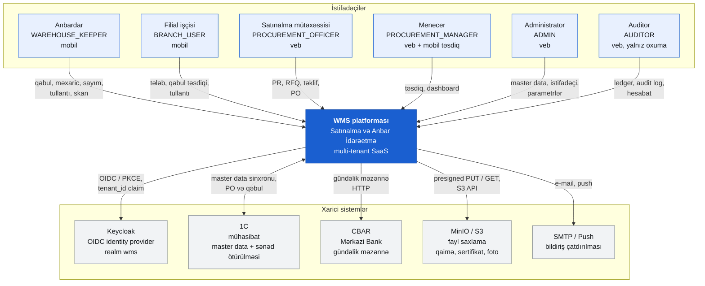

Qeyd: 1C inteqrasiyası Faza 4-dədir və master data sahibliyi hələ həll olunmayıb
([SPEC §20.2](../SPEC-Satinalma-Anbar-Platformasi.md#202-1c-də-master-data-sahibliyi)).

---

> **Filial əməliyyatları ayrıca sənəddədir.** Filial istehlakı modeli, resept/BOM,
> satış importu və fərq analizi üçün bax: [branch-operations.md](branch-operations.md)
> (qərar: [ADR-012](../adr/ADR-012-branch-consumption-model.md)).

## 2. Konteyner diaqramı (C4 — Level 2)

Cloud profili ([SPEC §18.1](../SPEC-Satinalma-Anbar-Platformasi.md#181-cloud-profili)).
Bütün modul konteynerləri **eyni image-dən** qalxır, yalnız `Modules` dəyişəni fərqlidir (ADR-001).

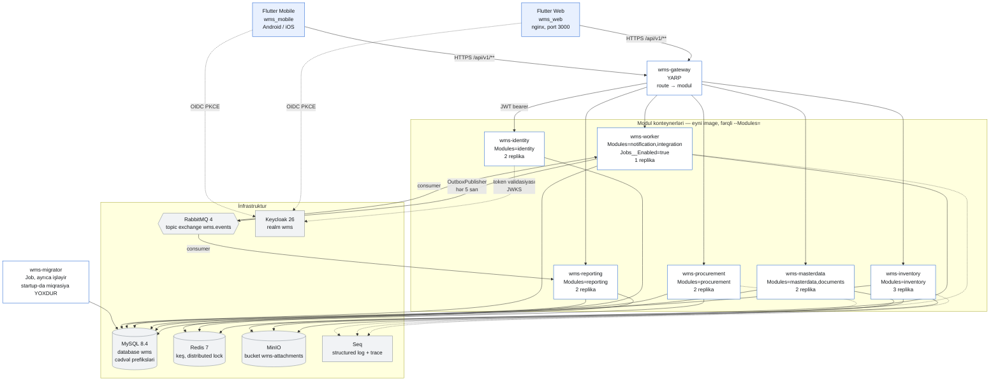

`Documents` modulu `wms-masterdata` ilə, `Notification` və `Integration` isə `wms-worker`
ilə birgə deploy olunur (CONVENTIONS). `Jobs__Enabled=true` yalnız worker-dədir — Hangfire
job-ları bir dəfə işləməlidir.

---

## 3. Deployment: cloud vs on-prem

Eyni image, iki profil ([SPEC §18](../SPEC-Satinalma-Anbar-Platformasi.md#18-deployment)).

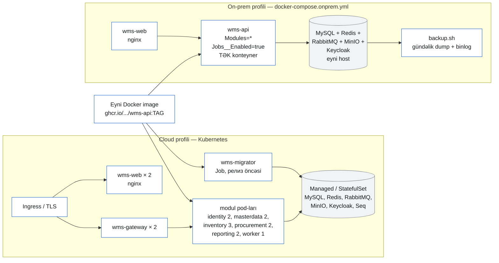

| | Cloud | On-prem |
|---|---|---|
| Konteyner sayı | 7 tətbiq + infra | 2 tətbiq + infra |
| `Modules` | modul başına bir dəyər | `*` |
| Miqrasiya | `Job` (релиз öncəsi) | `scripts/db-migrate.sh` |
| Scale | HPA, inventory 3 replika | şaquli (host resursu) |
| Backup | managed MySQL + MinIO replikasiyası | `deploy/onprem/backup.sh` |
| RPO / RTO | ≤ 15 dəq / ≤ 4 saat | müqavilə ilə |

---

## 4. Modul asılılıqları

[SPEC §5](../SPEC-Satinalma-Anbar-Platformasi.md#5-modul-sərhədləri). Ox = "asılıdır"
(yalnız `*.Contracts` interfeysləri üzərindən). Şemalararası FK və JOIN yoxdur.

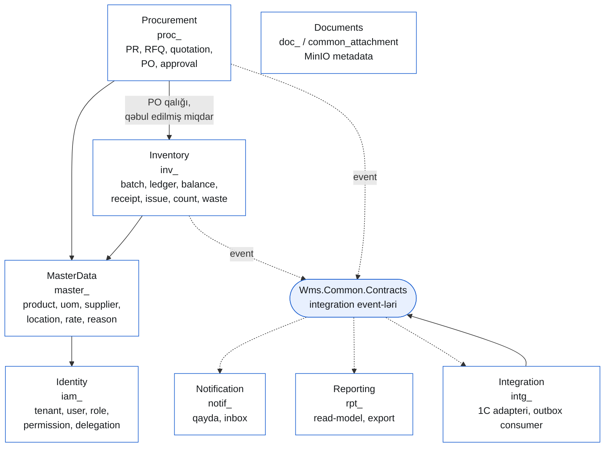

- **Düz ox** — sinxron asılılıq (`IProductCatalog` və s., `ModuleTransport` ilə in-process və ya HTTP).
- **Punktir ox** — asinxron, outbox → RabbitMQ. Notification, Reporting və Integration heç bir
  modula **sinxron** asılı deyil; onlar yalnız event oxuyur.
- `Documents` heç kimdən asılı deyil; başqa modullar ona `attachmentId` ilə istinad edir.

---

## 5. Ardıcıllıq diaqramları

### (a) Qəbulun post edilməsi — `postGoodsReceipt`

Tək tranzaksiya: partiya → ledger → balans → outbox. Sonra asinxron bildiriş.
([SPEC §12.2](../SPEC-Satinalma-Anbar-Platformasi.md#122-balans-yalnız-ledger-dən-törəyir), §12.3, §14.1)

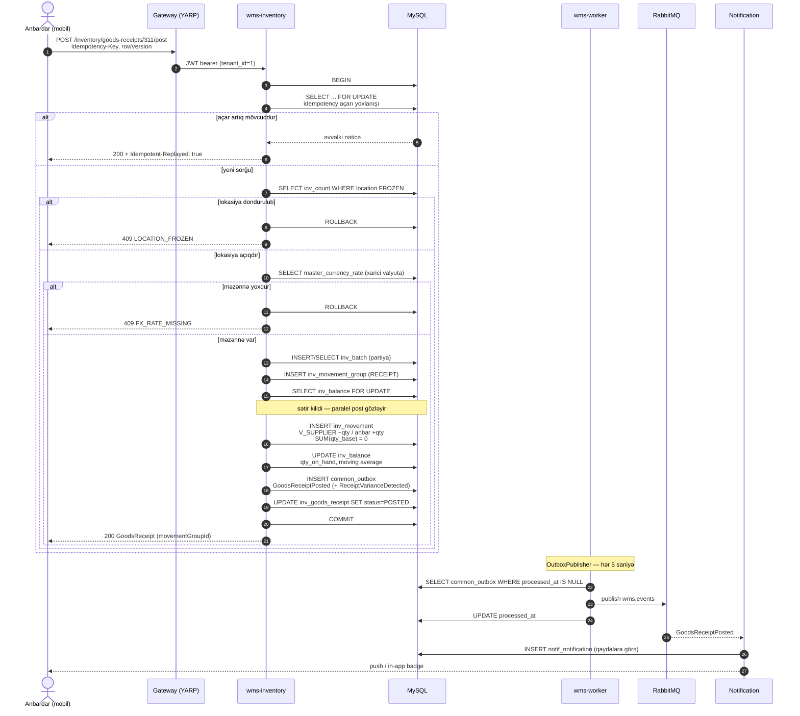

### (b) Məxaric → IN_TRANSIT → filial təsdiqi

İki ayrı hərəkət qrupu, iki ayrı tranzaksiya; aralıqda mal `IN_TRANSIT` virtual
lokasiyasındadır ([SPEC §12.3](../SPEC-Satinalma-Anbar-Platformasi.md#123-i̇kili-yazılış--hər-sənəd-sıfıra-balanslaşır)).

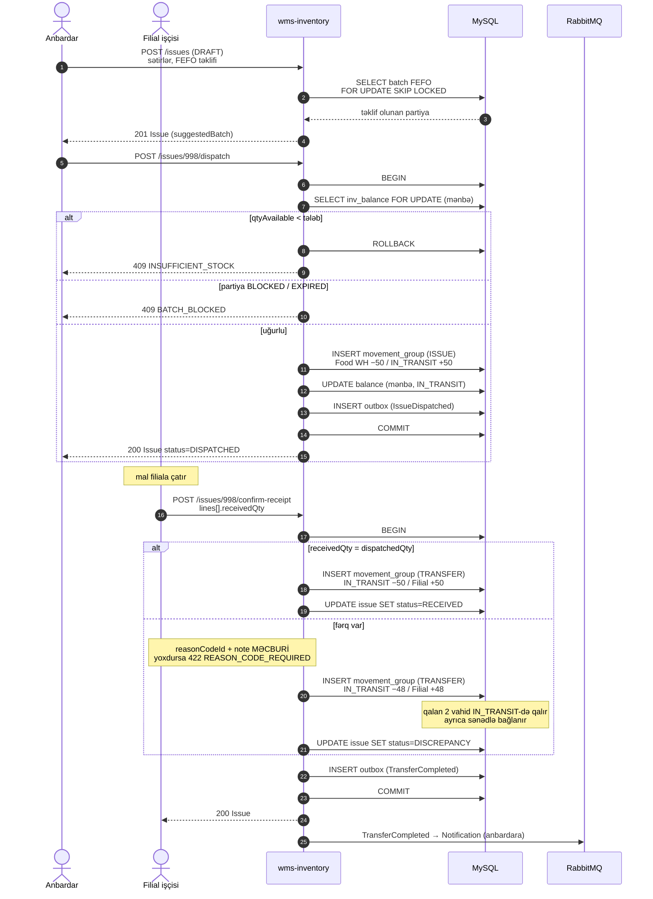

### (c) Sayım: dondurma → fərq → təsdiq → COUNT_ADJUST

([SPEC §12.6](../SPEC-Satinalma-Anbar-Platformasi.md#126-düzəliş-yalnız-sənədlə), §12.7)

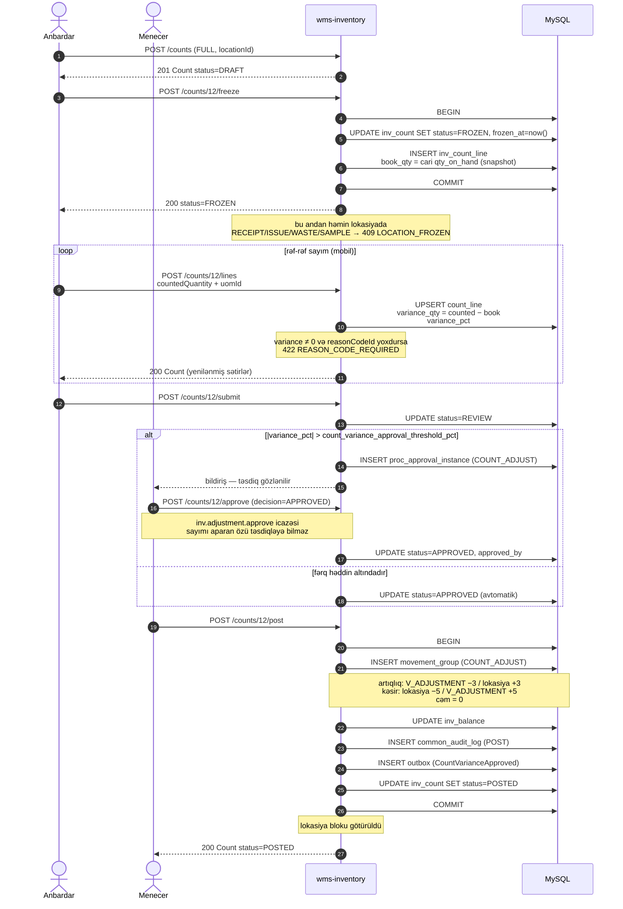

### (d) PO təsdiqi — parametrik qaydalar + delegasiya

([SPEC §10](../SPEC-Satinalma-Anbar-Platformasi.md#10-şema-proc), TOR §10/§36)

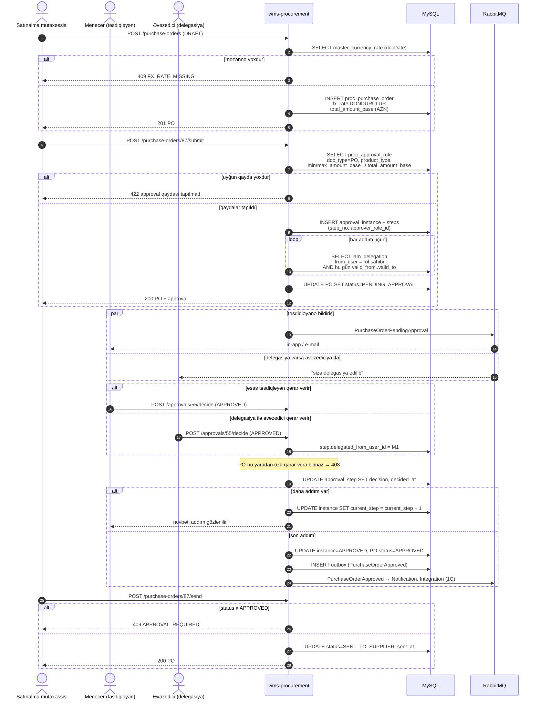

### (e) Mobil login (PKCE) və `tenant_id` ilə API çağırışı

([SPEC §16](../SPEC-Satinalma-Anbar-Platformasi.md#16-təhlükəsizlik), ADR-009)

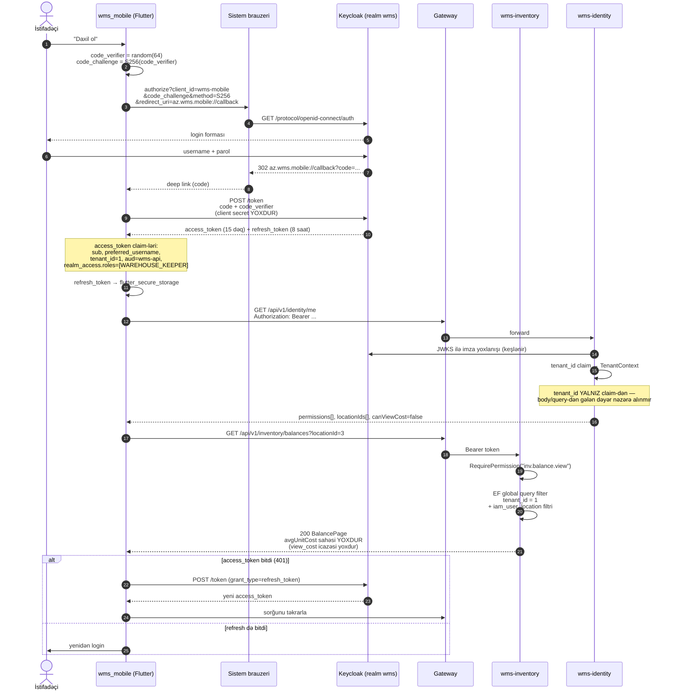

---

## 6. Vəziyyət diaqramları

### PO statusu

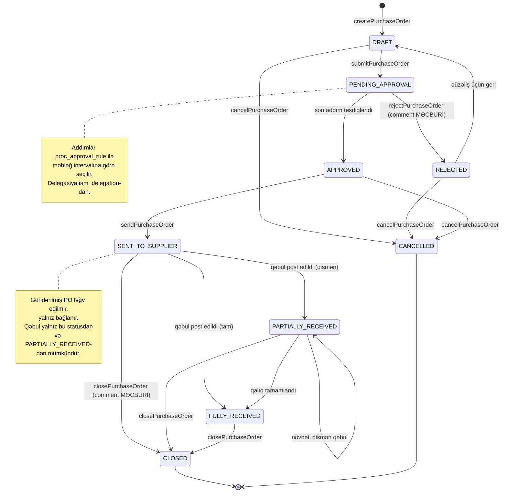

### İnventarizasiya statusu

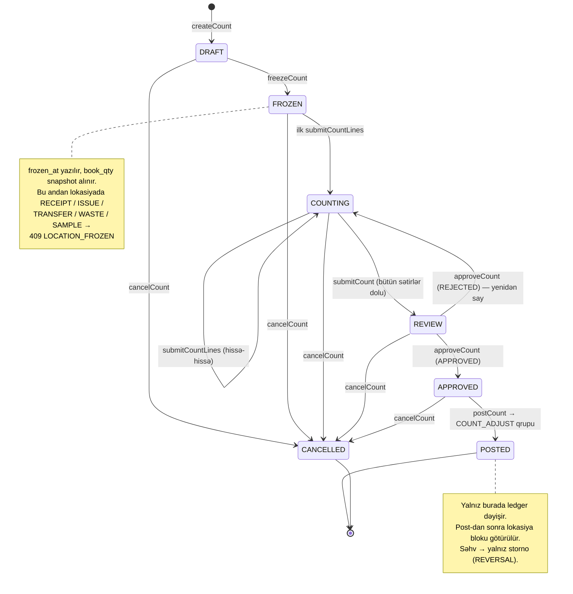

---

## 7. Əlaqəli sənədlər

| Sənəd | Nə var |
|---|---|
| [`data-model.md`](data-model.md) | `inv` və `proc` ER diaqramları, ikili yazılış cədvəli |
| [`../adr/README.md`](../adr/README.md) | 11 arxitektura qərarı |
| [`../../contracts/README.md`](../../contracts/README.md) | API kontraktları, contract-first axın |
| [`../ux/screen-map.md`](../ux/screen-map.md) | Rol × platforma ekran xəritəsi |
| [`../design-system/README.md`](../design-system/README.md) | Dizayn sistemi, tokenlər, komponentlər |
| [`../../deploy/README.md`](../../deploy/README.md) | Compose, k8s, Keycloak realm, miqrasiya |
