# İstifadəçi axınları

> **Bu sənəd nəyi təsvir edir.** Burada yazılanların hamısı **22.09.2026 tarixində canlı sistemdə
> brauzerdən addım-addım yoxlanılıb**: veb `http://localhost:3000`, gateway `:5001`, Keycloak `:8180`.
> Sənəd **mövcud sistemi** təsvir edir, planlaşdırılanı yox. Axın yarımçıq qalırsa, bu, harada
> qırıldığı ilə birlikdə yazılıb — [§5](#5-hazır-olmayanlar) ayrıca bölmədir ki, demo zamanı
> dalana dirənən axın göstərilməsin.
>
> Düymə adları, status adları və xəta mətnləri **interfeysdən olduğu kimi köçürülüb**, tərcümə
> edilməyib. Sənəd nömrələri (`GR-2026-00075`, `IS-2026-00094`) yoxlama zamanı yaranmış real
> sənədlərdir.
>
> **Mənbələr:** [SPEC](../SPEC-Satinalma-Anbar-Platformasi.md) · [ekran xəritəsi](screen-map.md) ·
> [ROADMAP](../ROADMAP.md) · [ADR-003](../adr/ADR-003-double-entry-ledger.md) ·
> [ADR-012](../adr/ADR-012-branch-consumption-model.md) · [dizayn sistemi](../design-system/README.md)

---

## 1. Bir baxışda — dörd tərəf

Sistemdə altı rol var, lakin **əməliyyat baxımından dörd tərəf** var. Zəncir belə işləyir:
filialın qalığı azalır → mərkəzdən istəyir → mərkəz ya anbardan verir, ya da satın alır →
təchizatçı gətirir → anbar qəbul edir → mal filiala gedir → filial onu istehlak edir və sayır →
aradakı fərq ölçülür.

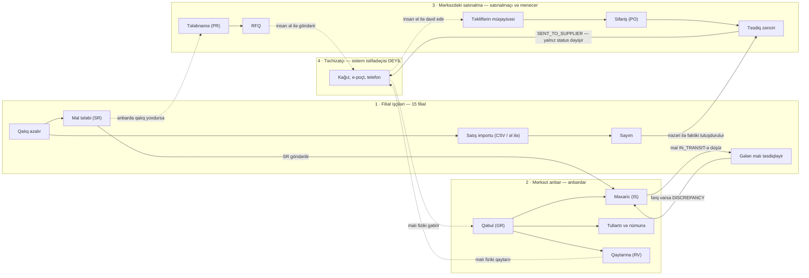

### 1.1. Hər tərəf nə edir

| Tərəf | İşi nə başladır | Sistemdə nə edir | Kimə nə ötürür | Nəyi gözləyir |
|---|---|---|---|---|
| **Filial işçiləri** (`branch1`, BRANCH_USER) | Rəfdə mal azalır; günün sonunda kassa hesabatı çıxır | «Mal tələbi» yazır və göndərir; gələn malı fərqi ilə birlikdə təsdiqləyir; satışı CSV ilə yükləyir; sayım sətirlərini doldurur; filial tullantısını yazır | Anbara tələb; mərkəzə satış məlumatı və sayım nəticəsi | Anbarın məxaric yaratmasını; sayım təsdiqini |
| **Mərkəzi anbar** (`keeper`, WAREHOUSE_KEEPER) | Filialdan tələb gəlir; təchizatçı qapıya mal gətirir | Qəbul yazır və post edir; məxaric yaradıb yola salır; sayım açır, lokasiyanı dondurur, post edir; tullantı və nümunə yazır; təchizatçıya qaytarma açır | Filiala mal; menecerə təsdiq üçün tullantı və sayım fərqi | Menecerin təsdiqini; filialın qəbul təsdiqini |
| **Mərkəzdəki satınalma** (`procurement` + `manager`) | Anbarda qalıq minimumdan aşağı düşür; filial tələbini anbar qarşılaya bilmir | Tələbnamə, RFQ, təklif, sifariş sənədlərinə baxır; ən ucuz olmayan təklif seçirsə səbəb yazır; sifarişi təsdiqləyir və ya rədd edir; tullantı və sayım fərqini təsdiqləyir | Təchizatçıya sifariş **sistemdən kənar**; anbara gözlənilən mal | Təchizatçının cavabını; anbarın qəbulunu |
| **Təchizatçı** | Satınalmaçı ona zəng edir, yazır və ya sifarişi göndərir | **Heç nə — sistemə girişi yoxdur** | Malı və qaiməni fiziki olaraq anbara | — |

> **Auditor və admin bu zəncirin içində deyil.** Auditor yalnız oxuyur (heç bir mutasiya icazəsi
> yoxdur), admin isə master data və istifadəçi tərəfini saxlayır. Hər ikisi [§2](#2-altı-rol)-də.

### 1.2. Təchizatçı: sistemin sərhədi

Bu bənd diqqətlə oxunmalıdır, çünki **təchizatçı sistemin içində olmayan yeganə tərəfdir** və
əməliyyat komandası bunu bilməlidir.

**Yoxlanılıb:** Keycloak realm-ində (`deploy/keycloak/realm-wms.json`) cəmi altı rol var —
`ADMIN`, `PROCUREMENT_OFFICER`, `PROCUREMENT_MANAGER`, `WAREHOUSE_KEEPER`, `BRANCH_USER`,
`AUDITOR`. **`SUPPLIER` rolu yoxdur.** Üç client var: `wms-web`, `wms-mobile`, `wms-api` —
**təchizatçı üçün client yoxdur**. `registrationAllowed: false`. Gateway-də anonim marşrut yoxdur.

Təchizatçı sistemdə yalnız **master data sətridir** (`master_supplier`) — haqqında məlumat yazılan
bir qeyd, sistemə girən bir istifadəçi deyil.

| Kontraktın vəd etdiyi | Əslində nə olur |
|---|---|
| **PO «Təchizatçıya göndər»** — `sentAt` yazılır, PDF yaradılır, e-poçt göndərilir (`contracts/openapi/procurement.v1.yaml`) | Yalnız status `SENT_TO_SUPPLIER`-ə keçir və audit sətri yazılır. **PDF yaranmır, e-poçt getmir, hadisə dərc olunmur.** Handler: `PurchaseOrderTransitions.cs:167-187` |
| **RFQ dəvət olunmuş təchizatçılara göndərilir** — «e-mail göndərişi Notification modulunun işidir» | Status `SENT`-ə keçir. Dəvət olunan təchizatçılar cədvəldə sətir kimi saxlanılır və **heç vaxt xəbərdar edilmir**. Handler: `RfqCommands.cs:161-206` |
| Təkliflər təchizatçıdan gəlir | Təklifi **daxili istifadəçi əl ilə daxil edir** (`proc.quotation.create`). Təchizatçı üçün giriş nöqtəsi, portal, fayl importu — heç biri yoxdur |

**Bütün backend-də bir dənə də e-poçt kodu yoxdur:** `SmtpClient`, `MailKit`, `SendGrid` —
heç biri; `Directory.Packages.props`-da poçt kitabxanası yoxdur; `appsettings.json`-da SMTP
bölməsi yoxdur. `master_supplier.email` sütunu var, lakin Procurement modulunun oxuduğu
`SupplierRefDto`-da o sahə **ümumiyyətlə yoxdur** — yəni modul təchizatçının e-poçtunu oxuya
bilməz, istəsə belə.

**Deməli təchizatçıya çatmağın yeganə real yolu budur:**

1. Satınalmaçı sifarişi ekranda açır və **«PDF»** düyməsini basır. Bu düymə `window.print()`
   çağırır — brauzerin öz çap pəncərəsi açılır (`PurchaseOrderDetailScreen.tsx:181`). Buradan
   kağıza çap edilir və ya «PDF-ə saxla» ilə fayl alınır.
2. Həmin faylı satınalmaçı **öz poçtundan** təchizatçıya göndərir, və ya çap edib verir, ya da
   telefonla danışır.
3. Təchizatçının cavabı (təklif, qiymət, çatdırılma müddəti) **əl ilə** sistemə yazılır.
4. Sistemdə `SENT_TO_SUPPLIER` statusu qoyulması yalnız **«mən bunu göndərdim» qeydidir** —
   sistem heç nə göndərmir.

Eyni şey qaytarmaya da aiddir: «Təchizatçıya göndər» addımı ledger-ə `RETURN` qrupu yazır və
malı balansdan çıxarır, lakin təchizatçıya heç bir bildiriş getmir — malı və sənədi insan aparır.

---

## 2. Altı rol

İcazələr təxmin edilməyib: hər istifadəçi üçün `GET /identity/me` oxunub.

| Rol | İstifadəçi | İcazə sayı | Lokasiya əhatəsi | Girişdən sonra hara düşür |
|---|---|---:|---|---|
| ADMIN | `admin` | 101 | hamısı (`iam.location.view_all`) | **Panel** |
| PROCUREMENT_MANAGER | `manager` | 70 | hamısı (`iam.location.view_all`) | **Panel** |
| WAREHOUSE_KEEPER | `keeper` | 47 | WH-01, WH-02 + `iam.location.view_all` | **Qəbul** |
| AUDITOR | `auditor` | 44 | hamısı (`iam.location.view_all`) | **Panel** |
| PROCUREMENT_OFFICER | `procurement` | 43 | hamısı (`iam.location.view_all`) | **Panel** |
| BRANCH_USER | `branch1` | 28 | **yalnız BR-NIZ** | **Məxaric və transfer** |

**Lokasiyalar.** Sistemdə iki mərkəzi anbar var — **Mərkəzi anbar (WH-01)** və
**Soyuducu anbar (WH-02)** — və **15 filial**: 28 May, Azadlıq, Bakıxanov, Elmlər, Gənclik,
Həzi Aslanov, İçərişəhər, Koroğlu, Memar Əcəmi, Nizami, Nərimanov, Sahil, Şəhriyar, Ulduz, Xətai.
Bunlardan əlavə beş **virtual lokasiya** var və onlar ikili yazılışın qarşı tərəfidir
([ADR-003](../adr/ADR-003-double-entry-ledger.md)): Təchizatçı (`V-SUP`), Yolda (`V-TRANSIT`),
Tullantı (`V-WASTE`), Düzəliş (`V-ADJ`), İstehlak (`V-CONS`). Virtual lokasiyalarda mənfi qalıq
normaldır — sənəd formalarının lokasiya siyahılarında onlar göstərilmir.

> **Lokasiya məhdudiyyəti həqiqətən işləyir.** `branch1` tokeni ilə `GET /inventory/balances`
> **yalnız BR-NIZ** sətirlərini qaytarır; `?locationId=2` (başqa filial) `200` və **sıfır sətir**
> verir. Məhdudiyyəti `locationIds` deyil, **`iam.location.view_all` icazəsinin olmaması** yaradır:
> anbardarın `locationIds` siyahısı `[1, 903]` olsa da, həmin icazə onda olduğu üçün bütün
> lokasiyaları görür. `ROADMAP` §2-də yazılmış «filial bütün şirkətin stokunu görür» boşluğu
> **bağlanıb**; `/internal/*` marşrutları da gateway-dən `404` qaytarır.

### 2.1. Hər rol nə görür və gündəlik nə edir

**Anbardar — `keeper`, WAREHOUSE_KEEPER (47 icazə)**
Girişdən sonra birbaşa **«Qəbul»** siyahısına düşür. Sol menyusu: Panel · Qəbul · Məxaric və
transfer · Mal tələbi · Sayım · Tullantı və nümunə · Qaytarma · Qalıqlar · Partiyalar · Ledger ·
Master data · Hesabatlar · İdarəetmə.
Gündəlik işi: gələn malı qəbul edib post etmək; filial tələblərindən məxaric yaradıb yola salmaq;
sayım açmaq, lokasiyanı dondurmaq və post etmək; tullantı yazmaq; təchizatçıya qaytarma açmaq.
**Qiymət görmür** — `master.product.view_cost` icazəsi yoxdur, ona görə «Vahid dəyəri» və
«Dəyər, AZN» sütunları onun ekranlarında **ümumiyyətlə render edilmir** (boş xana və ya `***` yox).

**Filial işçisi — `branch1`, BRANCH_USER (28 icazə)**
Girişdən sonra **«Məxaric və transfer»** ekranına düşür. Menyusu qısadır: Panel · Məxaric və
transfer · Mal tələbi · Sayım · Tullantı və nümunə · Qalıqlar · Partiyalar · Ledger · Reseptlər ·
Satış importu · Fərq hesabatı · Master data · Hesabatlar.
Gündəlik işi: mal tələbi yazıb göndərmək; gələn malı təsdiqləmək (fərq varsa səbəb kodu və qeydlə);
günün satışını CSV ilə yükləmək; sayım sətirlərini doldurmaq; filial tullantısını yazmaq.
**Post etmək icazəsi yoxdur** — nə qəbul, nə tullantı, nə sayım post edə bilir.

**Satınalmaçı — `procurement`, PROCUREMENT_OFFICER (43 icazə)**
**Panel**-ə düşür. Menyusu: Panel · Tələbnamə · RFQ · Təkliflər · Sifarişlər · Təsdiqlər ·
Qiymət tarixçəsi · Qəbul · Qalıqlar · Partiyalar · Master data · Hesabatlar.
Gündəlik işi: tələbnamələrə baxmaq, RFQ və təklifləri izləmək, müqayisə matrisindən təklif seçmək,
sifarişləri izləmək, qiymət tarixçəsinə baxmaq. **Qiymət görür** (`master.product.view_cost`).
**Təsdiq vermir** — `proc.approval.decide` icazəsi yoxdur, «Təsdiqlər» ekranı onun üçün həmişə boşdur.

**Menecer — `manager`, PROCUREMENT_MANAGER (70 icazə)**
**Panel**-ə düşür. Satınalmaçının gördüyü hər şeyi görür, üstəlik: təsdiq vermək
(`proc.approval.decide`, `proc.po.approve`), tullantı təsdiqi (`inv.waste.approve`), sayım fərqi
təsdiqi (`inv.adjustment.approve`), storno (`inv.movement.reverse`), master data redaktə icazələri,
audit jurnalı (`iam.audit.view`), delegasiya.
Gündəlik işi: «Təsdiqlər» qutusunu boşaltmaq; sifariş, tullantı və sayım fərqini təsdiqləmək və ya
rədd etmək; səhv post edilmiş sənədi storno etmək.
**Post etmir** — `inv.count.post` və `inv.waste.post` onda yoxdur; təsdiqdən sonra post etməyi
anbardar edir.

**Auditor — `auditor`, AUDITOR (44 icazə)**
**Panel**-ə düşür. İcazələrinin hamısı `*.view` tipindədir — **bir dənə də mutasiya icazəsi yoxdur**.
Ledger, audit jurnalı, bütün sənəd siyahıları, hesabatlar və export onun üçün açıqdır; qiyməti görür.

**Admin — `admin`, ADMIN (101 icazə)**
**Panel**-ə düşür. Bütün icazələrə sahibdir: master data, istifadəçi və rol, `inv_setting`
parametrləri, resept idarəetməsi, istehlak hesablaması (`cons.run.calculate`, `cons.run.post`),
inteqrasiya. Gündəlik iş rolu deyil — quraşdırma və nasazlıq rolu.

> **Qeyd — giriş ekranındakı fərq.** Anbardar və filial istifadəçisi serverdə
> `rpt.dashboard.view` icazəsinə **sahibdir** (menyuda «Panel» görünür və açılır), lakin giriş
> anında veb hələ `GET /identity/me` cavabını almadığı üçün icazələri müvəqqəti olaraq
> **rolun lokal xəritəsindən** hesablayır (`web/src/auth/permissions.ts`), orada isə bu iki rola
> `rpt.*` verilməyib. Yönləndirmə qərarı həmin ilk anda verilir — ona görə bu iki rol panelə yox,
> menyusunun ilk elementinə düşür. Bu, bloklanma deyil: «Panel» kliklənəndə normal açılır.

> **Qüsur — panelin təsdiq bloku iki rolda xəta göstərir.** Anbardar və ya filial istifadəçisi
> «Panel»i açanda «Mənim təsdiqim gözlənilir» bloku `GET /procurement/approvals/pending`
> sorğusunu göndərir, bu icazə isə onlarda yoxdur. Nəticədə ekranda texniki xəta çıxır:
> **«`FORBIDDEN` — Missing permission 'proc.approval.view'. · trace 00-b7f4…»**.
> Dizayn sisteminin qaydası bunun əksidir — icazəsi olmayan element **göstərilməməlidir**,
> xəta ilə göstərilməməlidir. *Bu yoxlama zamanı `DashboardScreen.tsx`-də düzəliş edilib: blok
> və onun göstəricisi həmin icazə olmadan render edilmir və sorğu ümumiyyətlə göndərilmir.
> Düzəliş mənbə kodundadır; `:3000`-dakı canlı sistem hazır konteyner obrazından işlədiyi üçün
> növbəti build-ə qədər yuxarıdakı xəta görünməyə davam edəcək.*

---

## 3. Uçdan-uca axınlar

Hər axın canlı sistemdə yerinə yetirilib və nəticə **verilənlər bazasından yoxlanılıb**.

### 3.1. Mal gəlir: sifariş → qəbul → post → balans və ledger

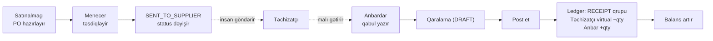

**Addımlar (anbardar kimi):**

1. Sol menyudan **«Qəbul»** → sağ üstdə **«Yeni qəbul»**.
2. Başlıqda: **«Təchizatçı»**, **«Sənəd tarixi»**, **«Qəbul lokasiyası»**, istəyə görə
   «Temperatur, °C», **«Keyfiyyət statusu»** (Tam qəbul edildi / Qismən qəbul edildi / Rədd edildi),
   «Qablaşdırma qeydi».
3. Sətirdə: məhsul, **«Partiya nömrəsi»**, **«Son istifadə tarixi»**, «Sifariş» (PO miqdarı),
   **«Qəbul edilən miqdar»**, «Rədd edilən miqdar».
   Miqdar sahəsi vahid seçicisi ilə gəlir və altında base ekvivalentini göstərir:
   `= 100 000,0000 G · əmsal 1 000,0000`.
4. Ekranın yuxarısında dəyişməyən xəbərdarlıq var: **«Post ayrıca addımdır — Sənəd əvvəlcə qaralama
   kimi yaradılır; balansa yalnız "Post et" addımından sonra düşür.»**
5. **«Qaralama yarat»** → sənəd yaranır və detal ekranı açılır (`201 POST /inventory/goods-receipts`).
6. Detal ekranında **«Post et»** → təsdiq dialoqu → yenə **«Post et»**.
7. Nəticə: **«Post edildi — GR-2026-00075 · Balans yeniləndi; hərəkətlər `RECEIPT` qrupuna yazıldı.»**
   Düymələr artıq yalnız «Çap et» və «Fayl yüklə»dir — **«Redaktə» düyməsi yoxdur**.

**Verilənlər bazasından yoxlanılıb** (`GR-2026-00075`, 100 KG toyuq, Mərkəzi anbar):

| Qrup | Lokasiya | Partiya | `qty_base` |
|---|---|---|---:|
| 294 `RECEIPT` | Təchizatçı (virtual) | FLOWDOC-A | −100 000,0000 |
| 294 `RECEIPT` | Mərkəzi anbar | FLOWDOC-A | +100 000,0000 |
| | | **cəm** | **0,0000** |

Balans: `inv_balance`-də FLOWDOC-A partiyası WH-01-də **100 000,0000 G** ilə yarandı.
Bütün ledger-də balanssız qrup sayı: **0**.

> **Zəncirin qırıq halqası: PO qəbula bağlanmır.**
> Veb qəbul ekranında **PO seçicisi yoxdur** — «Sifariş» sütunu sərbəst yazılan sahədir və
> doldurulmasa «PO-suz» qalır. `GET /procurement/purchase-orders/open-for-receipt` endpoint-i
> **işləyir** (anbardar tokeni ilə `200`), lakin veb onu **heç vaxt çağırmır**
> (`GoodsReceiptCreateScreen.tsx`-də istinad yoxdur). Nəticə: **təsdiqlənmiş sifarişlə real qəbul
> arasında sistemdə avtomatik bağ yaranmır**; sifarişin «Qəbul edilib / Qalıq» sütunları
> veb vasitəsilə yaradılmış qəbuldan dolmur. Bu, [§5](#5-hazır-olmayanlar)-də sadalanıb.

---

### 3.2. Filial mal istəyir: tələb → məxaric → yolda → filial təsdiqi

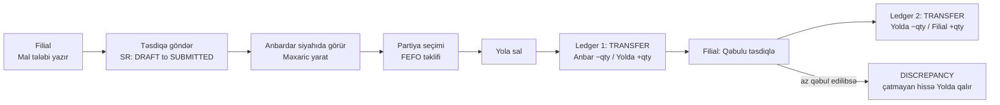

**Addımlar:**

1. **Filial** (`branch1`): **«Mal tələbi»** → **«Yeni tələb»**. Sahələr: «Sənəd tarixi»,
   **«Haradan (anbar)»**, **«Hara (filial)»**, «Tələb olunan tarix», «Qeyd», sətirdə məhsul və
   **«Tələb olunan miqdar»**.
   Xəbərdarlıq: **«Qaralama yaradılır, anbara göndərilmir — Tələb `DRAFT` statusunda yaranır.
   Anbarın növbəsinə yalnız sənəd ekranındakı "Təsdiqə göndər" addımından sonra düşür.»**
2. **«Qaralama yarat»** → **«Təsdiqə göndər»** → dialoqda **«Göndər»**. Status «Göndərilib».
3. **Anbardar**: **«Mal tələbi»** siyahısında sətrin sonunda **«Məxaric yarat»** əməliyyatı görünür.
   > Qeyd: bu əməliyyat **yalnız siyahıdadır**. Tələbin detal ekranını açan anbardar orada
   > yalnız «Çap et» görür — məxarici siyahıdan başlamaq lazımdır.
4. Məxaric ekranı tələbdən mənbə və hədəf lokasiyanı doldurulmuş gətirir. Sahələr: «Məxaric tipi»
   (Filiala məxaric / Anbarlararası transfer / Filiallararası transfer), **«Veriləcək miqdar»**,
   sağda **«Partiya seçimi»** paneli.
5. **Partiya seçimi FEFO qaydası ilə işləyir** — sistemin təklif etdiyi partiyanın yanında
   **«FEFO təklifi»** nişanı var. Başqası seçilərsə forma dərhal dəyişir: «Səbəb kodu» və «Qeyd»
   sahələri **məcburi** olur (`*` işarəsi əlavə olunur) və xəbərdarlıq çıxır —
   **«FEFO təklifindən kənar partiya seçildi. Sistem CHICKEN-2026B partiyasını təklif edir — onun
   son istifadə tarixi 25.09.2026. Başqa partiya seçildiyi üçün səbəb kodu və qeyd məcburidir.»**

   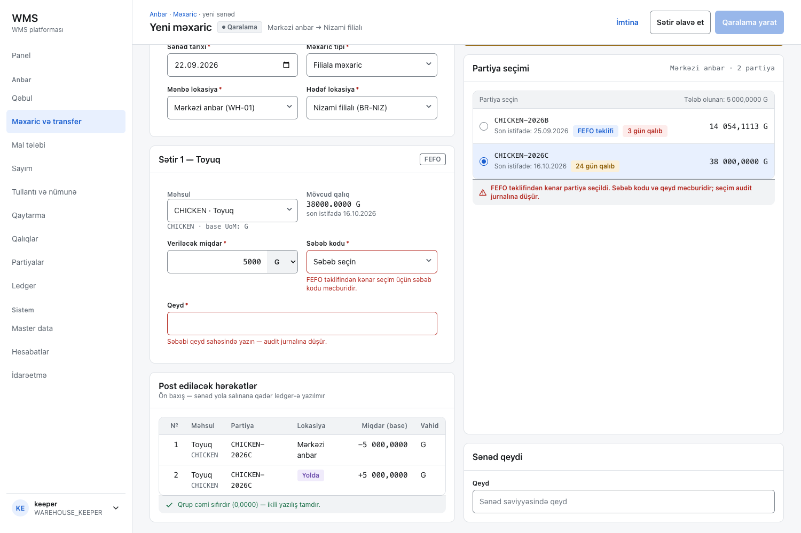

   Eyni ekranda **«Post ediləcək hərəkətlər»** paneli sənəd yaradılmamışdan əvvəl ikili yazılışı
   göstərir və altında yazır: **«Qrup cəmi sıfırdır (0,0000) — ikili yazılış tamdır.»**
6. **«Qaralama yarat»** → detal ekranında **«Yola sal»** → dialoq: **«Miqdar mənbə lokasiyadan
   çıxır və IN_TRANSIT-ə düşür.»**
7. Yola salındıqdan sonra: **«Mal yoldadır — Miqdar IN_TRANSIT lokasiyasındadır. Hədəf lokasiya
   qəbulu təsdiqləyənə qədər nə mənbədə, nə hədəfdə görünür — itki burada gizlənə bilmir.»**
8. **Filial**: həmin sənəddə **«Qəbulu təsdiqlə»** → **«Qəbul edilən miqdar»**, **«Fərqin səbəbi»**,
   «Qeyd». Fərq yazılan kimi son iki sahə məcburi olur və **«Təsdiqlə»** düyməsi onlar
   dolana qədər deaktiv qalır.
9. **«Təsdiqlə»** → sətirdə fərq göstəricisi çıxır: **`−1 000,000 G  −4,00 %  Təsdiq tələb edir`**.

**Verilənlər bazasından yoxlanılıb** (`IS-2026-00094`: 25 000 G göndərilib, 24 000 G qəbul edilib):

| Qrup | Lokasiya | `qty_base` |
|---|---|---:|
| 295 `TRANSFER` `IS-2026-00094` | Mərkəzi anbar | −25 000,0000 |
| 295 | Yolda (virtual) | +25 000,0000 |
| 296 `TRANSFER` `IS-2026-00094-R` | Yolda (virtual) | −24 000,0000 |
| 296 | Nizami filialı | +24 000,0000 |

Hər iki qrupun cəmi **0,0000**. Balanslar: WH-01 `39 054,1113 → 14 054,1113`;
BR-NIZ `10 000 → 34 000`; **çatmayan 1 000 G `V-TRANSIT`-də qaldı** (`710,2951 → 1 710,2951`).
Sənədin statusu: **`DISCREPANCY`**.

---

### 3.3. Satın alma: tələbnamə → RFQ → təkliflər → müqayisə → sifariş → təsdiq

```mermaid
flowchart LR
  PR["Tələbnamə (PR)"] --> RFQ["RFQ — ən azı 2 təchizatçı"]
  RFQ -.->|"insan göndərir"| S["Təchizatçı"]
  S -.->|"insan daxil edir"| Q["Təkliflər"]
  Q --> CMP["Müqayisə matrisi"]
  CMP -->|"ən ucuz seçilmirsə<br/>seçim qeydi məcburi"| SEL["Təklif seçilir"]
  SEL --> PO["Sifariş (PO)"]
  PO --> AP1["Təsdiq addımı 1<br/>PROCUREMENT_MANAGER"]
  AP1 -->|"AZN 5 000-dən yuxarı"| AP2["Təsdiq addımı 2<br/>ADMIN"]
  AP1 --> SENT["SENT_TO_SUPPLIER"]
  AP2 --> SENT
```

**Sənəd statuslarının tam dövrəsi canlı sistemdə var** (`PO-2026-90301`…`90310`): Qaralama,
Təsdiq gözləyir, Təsdiqlənib, Rədd edilib, Təchizatçıya göndərilib, Qismən qəbul edilib,
Tam qəbul edilib, Bağlanıb, Ləğv edilib.

**Təsdiq qaydaları** (`GET /procurement/approval-rules`, canlı):

| Sənəd tipi | Məbləğ (AZN) | Addım | Təsdiqləyən rol |
|---|---|---:|---|
| PO | 0 – 5 000 | 1 | PROCUREMENT_MANAGER |
| PO | 5 000,0001 – ∞ | 1 | PROCUREMENT_MANAGER |
| PO | 5 000,0001 – ∞ | 2 | ADMIN |
| WASTE | 0 – ∞ | 1 | PROCUREMENT_MANAGER |
| COUNT_ADJUST | 0 – ∞ | 1 | PROCUREMENT_MANAGER |

**Brauzerdə həqiqətən edilə bilən addımlar:**

1. **«Tələbnamə»**, **«RFQ»**, **«Təkliflər»**, **«Sifarişlər»** siyahıları dolu və oxunur.
2. **«RFQ»** siyahısından sətrə klik → **müqayisə matrisi** açılır. Sətirlər RFQ sətirləridir,
   sütunlar təkliflərdir. Hər xanada: vahid qiymət + valyuta, AZN ekvivalenti (`= 0,0124 AZN`),
   sətir cəmi, əvvəlki qiymətlə fərq faizi. Sətrin ən ucuzunda **«Sətirdə ən aşağı»** nişanı,
   ümumi ən ucuz təklifdə **«Ən ucuz»**, seçilmişdə **«Seçilib»**.
3. Ən ucuz **olmayan** təklifə klik → dialoq açılır: **«Təklifi seçim? — Ən ucuz təklif seçilmir —
   səbəb məcburidir (SPEC §10).»** **«Seçim qeydi»** sahəsi məcburidir və **«Seç»** düyməsi o
   dolana qədər **deaktivdir**.

   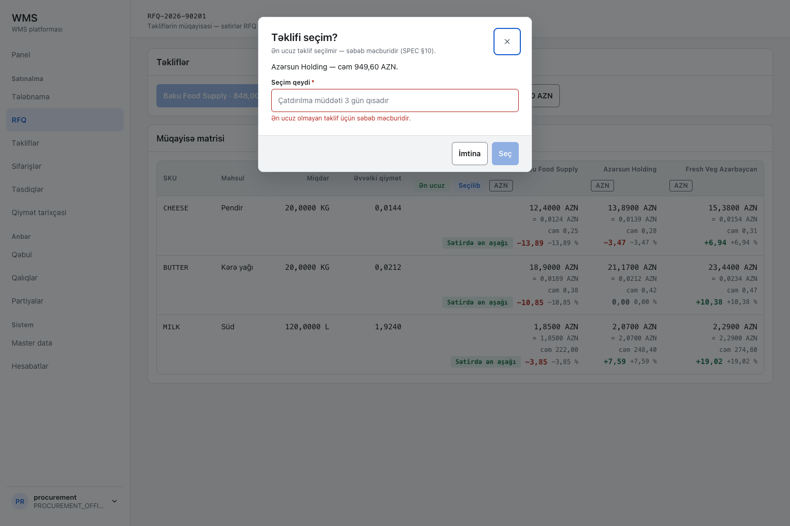

4. **«Sifarişlər»** siyahısından sənədə klik → sifariş detalı: sətirlər (miqdar, **vahid qiymət**,
   ƏDV, sətir cəmi), «Sifariş məlumatları» (dondurulmuş məzənnə daxil), **«Təsdiq zənciri»**,
   **«Qərarınız»**, «Təklif müqayisəsi».
5. **Menecer** **«Təsdiqlər»** qutusunda gözləyən sənədi görür: sənəd tipi, nömrə, xülasə,
   AZN məbləği, addım, tələbçi, delegasiya, gözləmə vaxtı.
   **Qərar bu ekranda verilmir** — sətir sənədin özünə keçid verir; «Təsdiqlə» və «Rədd et»
   sifariş detalındadır. Dialoq: **«Sifarişi təsdiqləyim? — Təsdiq növbəti addıma keçir və ya
   sənədi təsdiqlənmiş edir.»** «Şərh» sahəsi təsdiq zəncirində görünür və audit jurnalına düşür.
   > Bu qutuya bu gün **yalnız sifarişlər** düşür: tullantı və sayım fərqi öz sənədinin üzərində
   > təsdiqlənir, ayrıca approval instansı yaratmır (`proc_approval_instance`-də yalnız `PO` var).

**Yoxlanılıb:** `PO-2026-90302` (827,18 AZN) menecer tərəfindən təsdiqləndi →
status `PENDING_APPROVAL → APPROVED`, gözləyən təsdiq sayı `1 → 0`. Təsdiq zənciri ekranda
addım-addım göründü: `PROCUREMENT_MANAGER · manager · Təsdiqlədi · 22.09.2026 20:02`.
İki addımlı nümunə (`PO-2026-90303`, 6 844 AZN): addım 1 menecer, addım 2 admin —
**«Addım 2 / 2»**. Rədd nümunəsi (`PO-2026-90305`) şərhlə birlikdə görünür:
«Qiymət bazar səviyyəsindən yüksəkdir, yenidən danışıqlar aparın.»

> **Bu axının brauzerdən başlana bilməyən hissəsi.**
> Veb satınalma ekranlarında **yaratma əməliyyatı yoxdur**: nə «Yeni tələbnamə», nə «RFQ yarat»,
> nə «Təklif əlavə et», nə «PO yarat», nə də **«Təchizatçıya göndər»** düyməsi var.
> Bütün veb satınalma modulunda cəmi **iki yazma əməliyyatı** qurulub: `selectQuotation`
> (müqayisə ekranı) və `approvePurchaseOrder` (sifariş detalı).
> Backend tərəfdə 36 endpoint-in hamısı işləyir — yəni məhdudiyyət interfeysdədir, serverdə deyil.
> Praktik nəticə: **bu gün satınalma dövrəsi brauzerdən başladıla bilməz**; mövcud sənədlər
> seed datasıdır və yalnız «seç» və «təsdiqlə» addımları canlı işləyir.

---

### 3.4. Sayım: yarat → dondur → sayılan miqdar → fərq → təsdiq → post

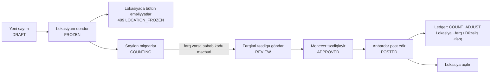

**Addımlar:**

1. **Anbardar**: **«Sayım»** → **«Yeni sayım»**. Dialoq: **«Lokasiya»**, **«Sayım tipi»**, «Qeyd».
   Ekranın başında dəyişməyən xəbərdarlıq: **«Dondurma lokasiyanı bloklayır — `freezeCount` işə
   düşdükdə həmin lokasiyada qəbul, məxaric, transfer, tullantı və nümunə əməliyyatları dayanır və
   server `409 LOCATION_FROZEN` qaytarır. Sayımı aparan özü təsdiqləyə bilməz (SoD, SPEC §7.1).»**
2. **«Yarat»** → sənəd `DRAFT` statusunda yaranır, **sətirsiz**: «Sətirlər dondurma anında yaradılır.
   "Lokasiyanı dondur" ilə başlayın.»
3. **«Lokasiyanı dondur»** → dialoq: **«Lokasiyanı dondurum? — Dondurma anından bu lokasiyada bütün
   hərəkətlər `409 LOCATION_FROZEN` alır.»** → **«Dondur»**.
   Dondurma anında **kitab qalığı yazılır** və sətirlər yaranır (nümunədə 42 sətir).
   Ekranda qırmızı bant: **«Soyuducu anbar lokasiyası dondurulub — Sayım tamamlanana qədər bu
   lokasiyada qəbul, məxaric, transfer, tullantı və nümunə əməliyyatları rədd edilir. Kitab qalığı
   dondurulma anında yazılıb (22.09.2026 20:10). `LOCATION_FROZEN`»**
4. **Sayılan miqdarların daxil edilməsi** — bax aşağıdakı xəbərdarlığa.
5. Fərq daxil edildikdən sonra ekranın başında dörd göstərici çıxır:
   **«Sayılan sətir 42 / 42 sətirdən»**, **«Fərqi olan sətir 1»**,
   **«Həddi aşan fərq 1 · `count_variance_approval_threshold_pct = 2`»**,
   **«Səbəbsiz fərq 0 · səbəb kodu olmadan təsdiqə göndərilmir»**.
   Fərqli sətir belə görünür: `LETTUCE-2026B · 10 000,000 · 9 500,000 · −500,000 G −5,00 % ·
   Təsdiq tələb edir`.

   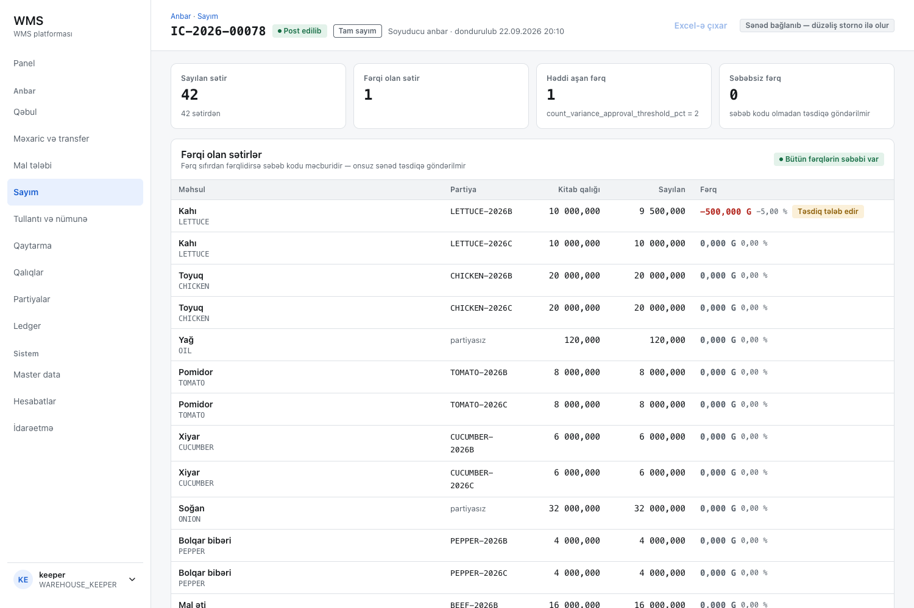

6. **«Fərqləri təsdiqə göndər»** → **«Həddi aşan fərqlər üçün approval instansı yaradılır.»**
   → status `REVIEW`.
7. **Anbardar bu sənədi təsdiqləyə bilmir** — «Təsdiqlə» düyməsi deaktivdir,
   səbəbi düymənin üzərində yazılıb: **«`inv.adjustment.approve` icazəniz yoxdur (SoD, SPEC §7.1)»**.
8. **Menecer** həmin sənədi açır və **«Təsdiqlə»** basır. Dialoq açıq şəkildə xatırladır:
   **«Sayımı aparan özü təsdiqləyə bilməz — server bunu `403` ilə rədd edir (SoD, SPEC §7.1).»**
   Menecer sətirlərdə **əlavə «Dəyər, AZN» sütununu görür** (`−4,10`) — anbardar bu sütunu görmür.
9. **Anbardar** post edir: **«Sayımı post edim? — `COUNT_ADJUST` qrupu yazılır və lokasiya açılır.
   Post edilmiş sayım redaktə olunmur.»** → **«Post et»**.
   Menecer post edə bilmir (`inv.count.post` onda yoxdur) — düymə deaktivdir.

**Verilənlər bazasından yoxlanılıb** (`IC-2026-00078`, Soyuducu anbar, 42 sətir, 1 fərq):

| Qrup | Lokasiya | Partiya | `qty_base` | `unit_cost` |
|---|---|---|---:|---:|
| 297 `COUNT_ADJUST` | Soyuducu anbar | LETTUCE-2026B | −500,0000 | 0,0082 |
| 297 | Düzəliş (virtual) | LETTUCE-2026B | +500,0000 | 0,0082 |
| | | **cəm** | **0,0000** | |

Balans: WH-01… LETTUCE-2026B `10 000 → 9 500`. Sənəd statusu `POSTED`, lokasiya açıldı.

> **Zəncirin qırıq halqası: sayılan miqdar vebdən daxil edilmir.**
> Dondurulduqdan sonra sayım detal ekranında **bir dənə də giriş sahəsi yoxdur** — «Sayılan» sütunu
> yalnız oxunur, «sayılmayıb» yazılır. Kod bunu özü izah edir: «Fərqləri təsdiqə göndər» düyməsinin
> üzərindəki mətn **«Heç bir sətir sayılmayıb — sayım mobil tətbiqdə aparılır»**-dır
> (`CountDetailScreen.tsx:213`). Mobil tətbiq isə **cari API ilə işləmir**
> ([§5](#5-hazır-olmayanlar)). Deməli **bu gün sayılan miqdarı heç bir istifadəçi interfeysindən
> daxil etmək mümkün deyil**.
> Yuxarıdakı 4-cü addım bu yoxlamada `POST /inventory/counts/76/lines` endpoint-i birbaşa
> çağırılaraq tamamlanıb; qalan bütün addımlar brauzerdən icra edilib. Endpoint özü düzgün işləyir
> və səbəb kodu qaydasını tətbiq edir (bax [§4](#4-işləyərkən-qarşılaşdığınız-qaydalar)).

---

### 3.5. Tullantının silinməsi: səbəb kodu və foto → təsdiq → post

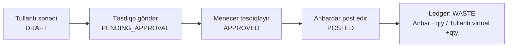

**Addımlar:**

1. **«Tullantı və nümunə»** siyahısı. Başında xəbərdarlıq: **«Öz sənədini təsdiqləmək olmaz —
   Səbəb kodunda `requiresApproval=true` olduqda sənəd `PENDING_APPROVAL` statusuna keçir;
   yaradan özü təsdiqləyə bilməz (SoD, SPEC §7.1).»**
2. Qaralama sənədini açın → **«Təsdiqə göndər»** → **«Sənəd `PENDING_APPROVAL` statusuna keçir;
   bundan sonra sətirlər dəyişmir.»**
3. **Menecer** → **«Təsdiqlə»** (şərh audit jurnalına düşür) → `APPROVED`.
4. **Anbardar** → **«Post et»** → `POSTED`.

**Verilənlər bazasından yoxlanılıb** (`WS-2026-00047`, 4,6949 G pomidor, Mərkəzi anbar):

| Qrup | Lokasiya | `qty_base` |
|---|---|---:|
| 298 `WASTE` | Mərkəzi anbar | −4,6949 |
| 298 | Tullantı (virtual) | +4,6949 |
| | **cəm** | **0,0000** |

**Səbəb kodları və davranışları** (`GET /masterdata/reason-codes`, canlı):

| Kod | Ad | Qrup | Foto tələb edir | Təsdiq tələb edir |
|---|---|---|---|---|
| WST-EXP | Vaxtı keçmiş | WASTE | bəli | bəli |
| WST-DMG | Zədələnmiş | WASTE | bəli | bəli |
| WST-SPOIL | Xarab olmuş | WASTE | bəli | bəli |
| WST-PREP | Hazırlıq itkisi | WASTE | xeyr | xeyr |
| ADJ-ERR | Səhv sənəd — düzəliş | ADJUSTMENT | xeyr | xeyr |
| ADJ-COUNT / ADJ-FOUND / ADJ-LOST | Sayım fərqi / Tapılmış mal / İtmiş mal | ADJUSTMENT | xeyr | bəli |
| RET-QUAL / RET-WRONG | Keyfiyyət uyğunsuzluğu / Səhv çatdırılma | RETURN | bəli / xeyr | bəli |
| TRF-SHORT / TRF-BATCH | Çatışmazlıq — transfer / Partiya dəyişikliyi | TRANSFER | bəli / xeyr | bəli / xeyr |
| SMP-AQTA / SMP-LAB | AQTA nümunəsi / Laboratoriya analizi | SAMPLE | xeyr | xeyr |

> **İki qırıq halqa.**
> **(a) Tullantı vebdən yaradılmır.** «Tullantı və nümunə» ekranında **«Yeni tullantı» düyməsi
> yoxdur**. Mövcud sənədin bütün sonrakı addımları isə vebdə tam qurulub — təsdiqə göndərmə,
> təsdiq və rədd (şərhlə), post. Yəni əskik olan **yalnız birinci addımdır**.
> Nümunə (`SAMPLE`) sənədi üçün vəziyyət daha dardır: orada yalnız **post** var, nə yaratma,
> nə də qərar addımı.
> **(b) Foto məcburiliyi tətbiq olunmur.** `WST-DMG` səbəb kodunda `requiresPhoto=true`-dur və
> ekran bunu düzgün yazır: **«Əlavə tələb olunur — Səbəb kodu `requiresPhoto` olduqda sənəd ən azı
> bir foto olmadan təsdiqə göndərilmir. `VALIDATION_FAILED`»**. Buna baxmayaraq `WS-2026-00047`
> **heç bir əlavəsi olmadan** göndərildi (`200`), təsdiqləndi (`200`) və post edildi (`200`).
> Yəni **xəbərdarlıq mətndir, qayda deyil** — server foto tələbini yoxlamır.

---

### 3.6. Filial istehlakı: satış → nəzəri məxaric → çatışmazlıq → sayımla fərq

Bu axın [ADR-012](../adr/ADR-012-branch-consumption-model.md)-ə əsaslanır: filial stoku reseptlə
hesablanmış **nəzəri məxaric** vasitəsilə azalır, sonra fiziki sayımla tutuşdurulur.

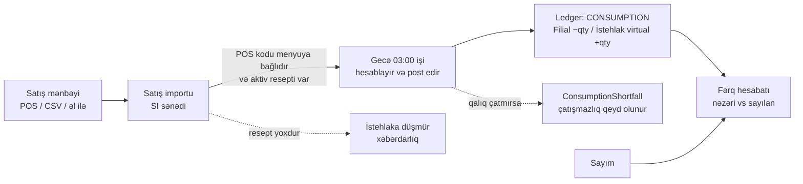

**Addımlar (filial kimi):**

1. **«Satış importu»** → **«CSV yüklə»**. Ekran üç addımdır: **«1. Fayl»** → **«2. Sütun xəritəsi»**
   → **«3. Önizləmə (ilk 50 sətir)»**.
   Fayl qaydası ekranda yazılıb: «Maksimum 5 MB. UTF-8 və Windows-1254 dəstəklənir; ayırıcı
   avtomatik aşkarlanır.»
2. **«İş günü»**, **«Lokasiya»**, istəyə görə «Xarici istinad» doldurulur.
3. Sütun xəritəsi seçilir (`posCode`, `qtySold`, `grossAmount`). Ekran göndəriləcək xəritəni
   açıq göstərir: `{"posCode":"posCode","qtySold":"qtySold","grossAmount":"grossAmount"}`.
4. Önizləmədə hər sətrin vəziyyəti görünür: **«Menyu maddəsi tapıldı»** və ya
   **«Bağlanmayıb»**. Bağlanmamış kodlar varsa qabaqcadan xəbərdarlıq çıxır:
   **«3 POS kodu menyu maddəsinə bağlı deyil — Bu kodlar import edildikdən sonra unmapped qalacaq
   və onlardan istehlak yaranmayacaq: …»**
5. **«Yüklə»** → sənəd yaranır (`SI-00006`). Reseptsiz maddə varsa:
   **«1 maddənin aktiv resepti yoxdur — Maddə tanınır, lakin resept olmadan nəzəri istehlak
   hesablana bilmir.»** Sətir vəziyyətləri: **«İstehlaka düşür»** / **«Resept yoxdur»**.
6. **Hesablama və post gecə işi ilə olur** — bax aşağıdakı xəbərdarlığa.
7. Nəticə **«İstehlak jurnalı»**nda görünür: iş günü, lokasiya, status, **«Çatışmazlıq»**,
   **«Uyğunsuz POS»**, hərəkət qrupu nömrəsi.
   Çatışmazlıq varsa sənəddə: **«2 sətirdə qalıq çatmadı — Nəzəri istehlakın bir hissəsi stokdan
   çıxarıla bilmədi. Ən çox rast gəlinən səbəb qeyd olunmayan qəbuldur — qəbul sənədlərini
   yoxlayın.»** Sətirlər: `Nəzəri (base) | Çıxarılan | Çatışmazlıq`, məsələn
   `15 000,0000 | 5 000,0000 | 10000.0000`.
8. **«Fərq hesabatı»** nəzəri ilə faktiki sayımı bir cədvəldə tutuşdurur:
   `Açılış · Qəbul · Nəzəri istehlak · Nümunə · Transfer (xalis) · Gözlənilən · Sayılan · Fərq`.
   Ekranın başında izah var: **«Fərq nəyi sübut edir, nəyi etmir — Mənfi fərqin üç səbəbi var:
   porsiya normadan böyükdür, tullantı qeyd olunmayıb, mal itib. Hesabat üçüncüsünü sübut etmir —
   ilk ikisini istisna etməklə sualı kəskinləşdirir.»**

**Verilənlər bazasından yoxlanılıb** (`CN-2026-00001`, Elmlər filialı):

| Qrup | Məhsul | Lokasiya | `qty_base` |
|---|---|---|---:|
| 3 `CONSUMPTION` | LETTUCE | Elmlər filialı | −2 173,9130 |
| 3 | LETTUCE | İstehlak (virtual) | +2 173,9130 |
| 3 | CHICKEN | Elmlər filialı | −15 000,0000 |
| 3 | CHICKEN | İstehlak (virtual) | +15 000,0000 |
| 3 | OIL | Elmlər filialı | −10 000,0000 |
| 3 | OIL | İstehlak (virtual) | +10 000,0000 |
| | | **cəm** | **0,0000** |

Çatışmazlıq nümunəsi (`CN-2026-00002`): nəzəri 15 000 G toyuqdan yalnız 5 000 G çıxarıldı,
qalan 10 000 G **çatışmazlıq kimi qeydə alındı** — ADR-012-nin tələb etdiyi davranış.

> **İstehlak hesablamasını əl ilə başlatmaq mümkün deyil.**
> İstehlak sənədini **yalnız gecə işi yaradır**: `ConsumptionRunnerJob`, cron `0 3 * * *`
> (UTC 03:00), əvvəlki iş günü üçün, hər filial üzrə. **`POST /consumption/runs` endpoint-i
> ümumiyyətlə yoxdur** — kontraktda yalnız `GET /runs`, `GET /runs/{id}`, `calculate`, `post`,
> `reverse` var. Vebdə də «Yeni hesablama» düyməsi yoxdur.
> Praktik nəticə: filial CSV-ni yükləyəndən sonra **növbəti gecəyə qədər heç nə baş vermir** və
> demo zamanı bu addımı canlı göstərmək mümkün deyil. Bu yoxlamada `SI-00006` yükləndi və
> gözlənildiyi kimi heç bir istehlak sənədi yaranmadı; yuxarıdakı ledger nəticəsi seed
> datasındakı iki sənəddən oxunub.

---

### 3.7. Səhvin düzəldilməsi: redaktə yoxdur, yalnız storno

**Nə üçün redaktə yoxdur.** Balans heç bir yerdə saxlanılan və düzəldilən rəqəm deyil — o,
`inv_movement` sətirlərinin **proyeksiyasıdır** ([ADR-004](../adr/ADR-004-balance-as-projection.md)).
Post edilmiş sənədi dəyişmək ledger-i tarixdən qopardardı. Ona görə post edilmiş hər sənəddə
**«Redaktə» düyməsi ümumiyyətlə render edilmir**; sayım sənədində bu, başlıqda açıq yazılır:
**«Sənəd bağlanıb — düzəliş storno ilə olur»**.

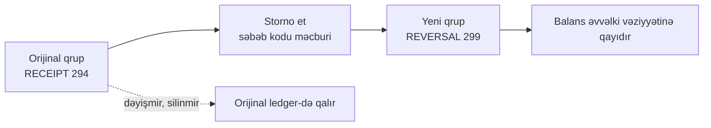

**Addımlar (menecer kimi — `inv.movement.reverse`):**

1. **«Ledger»** → sətrə klik və ya **«Qrup id ilə aç»**.
2. Hərəkət qrupu ekranı: «Qrup başlığı» (sənəd tarixi, post vaxtı, mənbə sənəd, storno),
   «Sətirlər» və altında **«Qrup cəmi sıfırdır (0,0000) — ikili yazılış tamdır.»**
   Bölmənin izahı: «Qrupun cəmi sıfır olmalıdır — bu, gecə işləyən `DoubleEntryCheck`-in
   interfeys tərəfidir».

   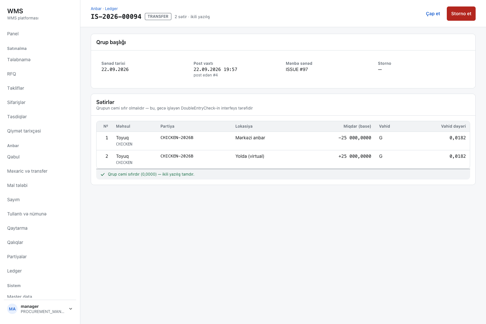

3. **«Storno et»** → dialoq: **«Bu qrupu storno edim? — Qrup silinmir və dəyişmir — əks işarəli
   yeni qrup yazılır və hər ikisi ledger-də qalır.»**
4. **«Səbəb kodu»** məcburidir (yalnız `ADJUSTMENT` qrupu təklif olunur: ADJ-COUNT, ADJ-ERR,
   ADJ-FOUND, ADJ-LOST). Altında: «Storno səbəbi audit jurnalına yazılır (SPEC §9.4).»
   **«Storno et»** düyməsi səbəb seçilənə qədər **deaktivdir**.
5. Təsdiqdən sonra ekran **yeni qrupa** keçir.

**Verilənlər bazasından yoxlanılıb** (294 nömrəli `RECEIPT` qrupunun stornosu):

| Qrup | Tip | Sənəd | `reverses_group_id` |
|---|---|---|---|
| 294 | `RECEIPT` | `GR-2026-00075` | — |
| 299 | `REVERSAL` | `REV-2026-00024` | **294** |

Storno qrupunun sətirləri orijinalın əksidir: Təchizatçı (virtual) **+100 000,0000**,
Mərkəzi anbar **−100 000,0000**. Balans `100 000 → 0`. **Orijinal qəbul sənədi `POSTED` olaraq
qalır** — nə silinir, nə dəyişir. Ledger-də balanssız qrup: **0**.

---

### 3.8. Təchizatçıya qaytarma

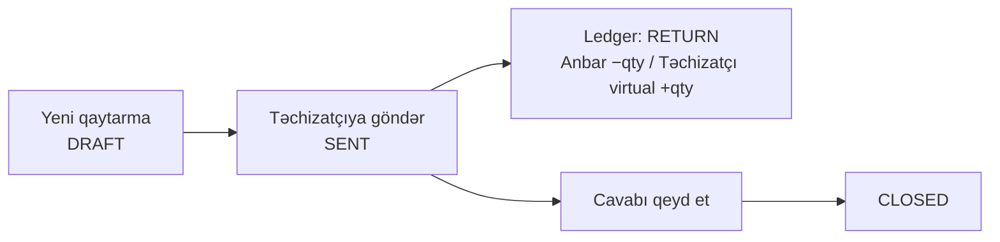

**Addımlar (anbardar kimi):**

1. **«Qaytarma»** → **«Yeni qaytarma»**.
2. Sahələr: «Sənəd tarixi», **«Təchizatçı»**, **«Lokasiya»**, «Mənbə qəbul id» (boş = qəbulsuz),
   **«Səbəb kodu»** (yalnız `RETURN` qrupu: RET-QUAL, RET-WRONG), sətirdə məhsul, **«Partiya»**,
   **«Qaytarılan miqdar»**, qeyd.
   Partiya siyahısı mövcud qalıqla birlikdə gəlir: `CHICKEN-2026C · 40000.0000`.
   Xəbərdarlıq: **«Qaralama yaradılır, ledger-ə yazılmır — Mal yalnız "Təchizatçıya göndər"
   addımında balansdan çıxır — `RETURN` qrupu o zaman yazılır (SPEC §12.3).»**
3. **«Qaralama yarat»** → **«Təchizatçıya göndər»** → status `SENT`, ledger yazılır.
4. **«Cavabı qeyd et»** → **«Təchizatçı qəbul etdi»** / **«Təchizatçı qəbul etmədi»** → `CLOSED`.

**Verilənlər bazasından yoxlanılıb** (`RV-2026-00043`, 2 000 G toyuq):

| Qrup | Lokasiya | `qty_base` |
|---|---|---:|
| 300 `RETURN` | Mərkəzi anbar | −2 000,0000 |
| 300 | Təchizatçı (virtual) | +2 000,0000 |
| | **cəm** | **0,0000** |

Balans: WH-01 CHICKEN-2026C `40 000 → 38 000`.

> **Diqqət:** «Təchizatçıya göndər» adına baxmayaraq bu addım **təchizatçıya heç nə göndərmir** —
> o, yalnız malı balansdan çıxarır və statusu dəyişir. Təchizatçı ilə əlaqə
> [§1.2](#12-təchizatçı-sistemin-sərhədi)-dəki qayda ilədir.

---

## 4. İşləyərkən qarşılaşdığınız qaydalar

Bunlar invariant siyahısı deyil — **nəyisə etməyə cəhd edəndə nə baş verdiyidir**. Hər mesaj canlı
sistemdən olduğu kimi köçürülüb.

### 4.1. Sənəd yazarkən

| Nə etməyə çalışırsınız | Nə alırsınız |
|---|---|
| Sayım fərqi yazıb səbəb kodu göstərmirsiniz | Server `422 REASON_CODE_REQUIRED` qaytarır — «Product 1 has a non-zero variance; reason_code_id is mandatory (spec §12.6).» Vebdə bunun qarşılığı **«Səbəbsiz fərq»** göstəricisidir: altında «səbəb kodu olmadan təsdiqə göndərilmir» yazılır və sıfırdan böyük olduqda «Fərqləri təsdiqə göndər» düyməsi deaktiv qalır |
| FEFO təklifindən başqa partiya seçirsiniz | Forma dərhal dəyişir: «Səbəb kodu» və «Qeyd» məcburi olur. Sahə altı: **«FEFO təklifindən kənar seçim üçün səbəb kodu məcburidir.»** və **«Səbəbi qeyd sahəsində yazın — audit jurnalına düşür.»** |
| Filial işçisi kimi anbardan göndəriləndən **az** mal qəbul edirsiniz | «Fərqin səbəbi» və «Qeyd» məcburi olur, «Təsdiqlə» onlar dolana qədər deaktiv qalır. Təsdiqdən sonra sənəd `DISCREPANCY` statusuna keçir, çatmayan hissə **`IN_TRANSIT`-də qalır** |
| Filial işçisi kimi göndəriləndən **çox** mal qəbul etməyə çalışırsınız | «Təsdiqlə» düyməsi deaktiv qalır |
| Ən ucuz olmayan təklifi seçirsiniz | Dialoq: **«Ən ucuz təklif seçilmir — səbəb məcburidir (SPEC §10).»** «Seçim qeydi» məcburi, «Seç» deaktiv |
| Post edilmiş sənədi dəyişmək istəyirsiniz | **«Redaktə» düyməsi yoxdur.** Sayımda başlıqda yazılıb: «Sənəd bağlanıb — düzəliş storno ilə olur» |
| Storno edərkən səbəb göstərmirsiniz | «Storno et» düyməsi deaktiv; səbəb siyahısı yalnız `ADJUSTMENT` qrupundan gəlir |

### 4.2. Post edərkən server nə deyir

| Nə etməyə çalışırsınız | Nə alırsınız |
|---|---|
| Dondurulmuş lokasiyada qəbul post edirsiniz | `409 LOCATION_FROZEN` — **«Location 903 is frozen by an inventory count; operations are blocked.»** Qaralamanın yaradılması **bloklanmır** — rədd yalnız post anında gəlir |
| Qalıqdan çox mal yola salırsınız | `409 INSUFFICIENT_STOCK` — **«Allocatable quantity 14054.1113 is below the requested 999999999.0000.»** |
| Öz yazdığınız sənədi özünüz təsdiqləyirsiniz | `403 SELF_APPROVAL_FORBIDDEN` — **«The user who raised the document cannot approve it (segregation of duties).»** |
| Sənədi başqası dəyişdikdən sonra göndərirsiniz | `409 STALE_VERSION` — **«The record was modified by another user. Reload and retry.»** |
| Eyni lokasiyada ikinci açıq sayım yaradırsınız | `422 COUNT_ALREADY_OPEN` — **«Location 903 already has an open inventory count (IC-2026-90001).»** |
| Eyni filial və gün üçün ikinci satış importu yükləyirsiniz | `409 DUPLICATE_BUSINESS_DATE` — **«Location 904 already has a document for 2026-09-22; correct it or reverse it instead of creating a second one.»** |
| Nöqtəvi və ya dövri sayım yaradırsınız | `422 COUNT_SCOPE_REQUIRED` — **«A SPOT count needs productIds.»** / **«A CYCLE count needs categoryIds or productIds.»** Bax [§5](#5-hazır-olmayanlar) |
| `Idempotency-Key` başlığı olmadan sorğu göndərirsiniz | `400 IDEMPOTENCY_KEY_REQUIRED` — «POST requests require an 'Idempotency-Key' header containing a GUID.» |

> **Xəta mesajları ingiliscədir.** İnterfeys tam Azərbaycan dilindədir, lakin serverdən gələn
> izah mətnləri ingiliscə qalır. Ekran kodu (`LOCATION_FROZEN`, `INSUFFICIENT_STOCK`) həmişə
> göstərir — dəstək komandası bu kodla işləyir — üstəlik `trace` identifikatorunu da yazır.
> Bu, `ROADMAP` §5-də qeyd olunmuş və hələ bağlanmamış boşluqdur.

### 4.3. Görmədiyiniz şeylər

| Vəziyyət | Nə baş verir |
|---|---|
| Anbardar qiymət sütunlarına baxır | **Sütun ümumiyyətlə render edilmir.** Eyni sayım sənədində anbardar `Məhsul · Partiya · Kitab qalığı · Sayılan · Fərq` görür, menecer isə əlavə **`Dəyər, AZN`** sütununu. Boş xana və ya `***` yoxdur |
| Anbardar «Qiymət tarixçəsi» ekranını açmağa çalışır | Menyuda **element ümumiyyətlə yoxdur**; birbaşa URL ilə gedilsə `403 FORBIDDEN` — «Missing permission 'master.product.view_cost'.» |
| Filial istifadəçisi başqa filialın qalığına baxır | `200` cavab, **sıfır sətir**. Filial yalnız öz lokasiyasını görür |
| Satınalmaçı «Təsdiqlər» qutusunu açır | Ekran açılır, lakin həmişə boşdur: «Gözləyən təsdiq yoxdur. Yeni sənəd təsdiqə göndərildikdə burada görünəcək.» — `proc.approval.decide` icazəsi onda yoxdur |

> **Vaxtı keçmiş partiya qaydası brauzerdə yoxlana bilmədi.** Bazada 17 `EXPIRED` partiya var,
> lakin **heç birinin fiziki lokasiyada qalığı yoxdur** (hamısının `qty_on_hand = 0`), ona görə
> partiya seçicisində onları seçib `409 BATCH_BLOCKED` almaq mümkün olmadı. Qayda
> [SPEC §12.4](../SPEC-Satinalma-Anbar-Platformasi.md) və [ekran xəritəsi §3.6](screen-map.md)-da
> təsvir olunub; bu sənəd onu **koddan deyil, canlı təcrübədən təsdiqləyə bilmir**.

### 4.4. Yazılış qaydası ilə uyğunsuzluq

Dizayn sistemi rəqəm formatını dəqiq təyin edir: onluq ayırıcı vergül, min ayırıcı dar boşluq
(`1 284,5000`). İki yerdə bu pozulur və rəqəm xam şəkildə çıxır:

- məxaric ekranında «Mövcud qalıq»: `38000.0000 G` (olmalı idi `38 000,0000 G`);
- istehlak sənədinin «Çatışmazlıq» sütunu: `10000.0000` (olmalı idi `10 000,0000`).

Eyni ekranlardakı bütün digər rəqəmlər düzgün formatlanır.

---

## 5. Hazır olmayanlar

Bu bölmə ayrıdır ki, **demo zamanı dalana dirənən axın göstərilməsin**. Yuxarıdakı axınların içindəki
qırıq halqalar da burada bir yerə yığılıb.

### 5.1. İnterfeysdə yaratma yolu olmayan sənədlər

Backend endpoint-ləri **işləyir**, veb ekranları isə yalnız oxuyur. Məhdudiyyət interfeysdədir.

| Sənəd | Vebdə nə var | Vebdə nə yoxdur |
|---|---|---|
| Tələbnamə (PR) | siyahı | yaratma, göndərmə, rədd |
| RFQ | siyahı | yaratma, göndərmə, bağlama |
| Təklif | siyahı, müqayisə matrisi, **seçim** | **daxil etmə** |
| Sifariş (PO) | siyahı, detal, **təsdiq / rədd** | yaratma, təsdiqə göndərmə, **«Təchizatçıya göndər»**, bağlama |
| Tullantı | siyahı, təsdiqə göndərmə, təsdiq, rədd, post | **yaratma** |
| Nümunə | siyahı, post | **yaratma**, qərar addımı |
| Sayım | yaratma, dondurma, təsdiq, post | **sayılan miqdarın daxil edilməsi** |
| İstehlak hesablaması | siyahı, detal, hesabla, post, storno | **yaratma** (yalnız gecə işi yaradır) |
| Master data (məhsul, təchizatçı, lokasiya, vahid, səbəb kodu, məzənnə) | siyahılar | **bütün yaratma və redaktə** |
| İstifadəçi, rol, `inv_setting` | siyahılar və matris | **bütün yaratma və redaktə** |

Məhsul, təchizatçı, lokasiya, səbəb kodu, istifadəçi və rol üçün **yazma endpoint-ləri artıq
mövcuddur** (boş gövdə ilə `400`, `404` deyil) — yəni `ROADMAP` Faza 1-in 1 və 2-ci bəndləri
backend tərəfdə bağlanıb, interfeys tərəfdə isə yox.

### 5.2. İşləməyən seçimlər

- **Nöqtəvi və dövri sayım.** «Sayım tipi» siyahısında hər üç variant görünür, lakin ekran
  əhatəni (`productIds` / `categoryIds`) toplamır, ona görə seçim həmişə `422 COUNT_SCOPE_REQUIRED`
  ilə bitir. *Bu yoxlama zamanı `web/src/features/inventory/CountsScreen.tsx`-də kiçik düzəliş
  edilib: iki variant siyahıda qalır, lakin seçilə bilmir və səbəbi sahənin altında yazılır.
  Düzəliş mənbə kodundadır; `:3000`-dakı canlı sistem hazır obrazdan işlədiyi üçün növbəti
  build-dən sonra görünəcək.*
- **PDF export.** `EXPIRY` hesabatı üçün `PDF` formatı `422 UNSUPPORTED_FORMAT` qaytarır —
  «Report 'EXPIRY' does not support the 'PDF' export format.» Yalnız `CSV` və `XLSX` işləyir.
- **PO-nun qəbula bağlanması.** `GET /procurement/purchase-orders/open-for-receipt` işləyir,
  veb onu çağırmır.

### 5.3. Bildirişlər heç yerə çatdırılmır

Bu, sistemin ən geniş boşluğudur və əməliyyat komandası bunu bilməlidir.

- `notif_message` cədvəli **tamamilə boşdur** (0 sətir) — **heç bir kod ora yazmır**.
  `NotificationMessage.Create(...)` metodunun bütün repoda **bir dənə də çağırışı yoxdur**.
- `GET /notifications/` boş siyahı qaytarır; kontraktdakı `/notifications/inbox` marşrutu
  **`404`** verir. Kontraktın elan etdiyi doqquz marşrutdan **heç biri qurulmayıb**.
- Kanal adları (`IN_APP`, `EMAIL`, `PUSH`) yalnız sabit kimi mövcuddur; **e-poçt və push
  göndərən kod yoxdur**.
- Hadisələr **dərc olunur** — transaksiyalı outbox 15 hadisə tipini real RabbitMQ exchange-inə
  göndərir. Lakin **onları oxuyan heç nə yoxdur**: bütün backend-də bir dənə də consumer,
  `IHostedService` və ya hadisə handler-i yoxdur; heç bir növbə elan edilmir və bağlanmır.

**Praktik nəticə:** «Sizə mal göndərildi», «Sənəd təsdiq gözləyir», «Export hazırdır» tipli heç
bir bildiriş **heç kimə çatmır**. Hər bir rol öz siyahısına özü baxmalıdır. Axınların arasındakı
ötürmə **insan ünsiyyəti ilə** baş verir.

### 5.4. Mobil tətbiq cari API ilə işləmir

`ROADMAP` Faza 4-də yazıldığı kimi: tətbiq kompilyasiya olunur və 266 testi keçir, lakin əl ilə
yazılmış DTO-lar düz `productId` gözləyir, backend isə kontrakta uyğun iç-içə `product: {...}`
qaytarır. Filial təsdiqi mövcud olmayan marşruta göndərilir; sayım dövrəsi yarımçıqdır.

Bu, **§3.4-dəki qırıq halqanı bağlanmaz edir**: veb sayılan miqdarı mobil tətbiqə yönləndirir,
mobil tətbiq isə serverlə danışa bilmir.

### 5.5. Data köçürməsi aləti yoxdur

`SPEC §19` Faza 0-ı ayrıca mərhələ kimi göstərir; **heç bir aləti yoxdur**. Mövcud seeder
dev datasıdır, köçürmə yolu deyil. Yeni müştəri üçün lazımdır: SKU təyini, base UoM və çevirmə
əmsalları, partiya səviyyəsində açılış qalıqları, təchizatçı bazası, açılış qiymətləri.
[ADR-012](../adr/ADR-012-branch-consumption-model.md) buna **resept master-ini** də əlavə edir:
hər menyu maddəsi üçün tərkib, porsiya miqdarı və itki faizi.

### 5.6. Hesabatlar: 9 / 24

Hesabat kataloqu **işləyir** və doqquz hesabat verir: `COUNT_VARIANCE`, `MOVEMENT_LEDGER`,
`BRANCH_CONSUMPTION`, `RECEIPT_VARIANCE`, `EXPIRY`, `WASTE_SUMMARY`, `STOCK_BALANCE`,
`STOCK_BY_BATCH`, `STOCK_COVERAGE`. Parametr forması hesabat tərifindən dinamik qurulur,
nəticə cədvəli açılır, **«Excel-ə çıxar»** işləyir: export növbəyə düşür, gecə işi deyil,
təxminən bir-iki dəqiqə ərzində `COMPLETED` olur və MinIO-dan imzalanmış keçidlə real fayl
yüklənir (bu yoxlamada 13 807 baytlıq `.xlsx` faylı endirildi).
`SPEC` 24 hesabat tələb edir — **15-i hələ yoxdur**.

---

## 6. Yoxlama qeydləri

Sənəddəki hər iddianın mənbəyi.

| Axın | Brauzerdə icra edildi | Verilənlər bazasından təsdiqləndi |
|---|---|---|
| Qəbul və post | bəli, tam | bəli — qrup 294, cəm 0, balans +100 000 G |
| Filial tələbi → məxaric → yolda → təsdiq | bəli, tam | bəli — qrup 295 və 296, cəm 0, çatışmazlıq `V-TRANSIT`-də |
| Sayım | qismən — sayılan miqdardan başqa hamısı | bəli — qrup 297 `COUNT_ADJUST`, cəm 0 |
| Tullantı | qismən — yaratmadan başqa hamısı | bəli — qrup 298 `WASTE`, cəm 0 |
| Storno | bəli, tam | bəli — qrup 299 `REVERSAL`, `reverses_group_id = 294` |
| Təchizatçıya qaytarma | bəli, tam | bəli — qrup 300 `RETURN`, cəm 0, balans −2 000 G |
| PO təsdiqi | bəli, tam | bəli — `PENDING_APPROVAL → APPROVED`, gözləyən 1 → 0 |
| Təklif seçimi qaydası | bəli — dialoq və məcburi sahə | — *(seçim təsdiqlənmədi, seed datası dəyişdirilmədi)* |
| Satış importu (CSV) | bəli, tam | bəli — `SI-00006` yarandı |
| İstehlak hesablaması | xeyr — əl ilə başladıla bilmir | bəli — qrup 3 və 4 `CONSUMPTION`, cəm 0 *(seed datası)* |
| Satınalma dövrəsinin başlanğıcı | xeyr — vebdə yaratma yolu yoxdur | — |

**Ledger invariantı:** bütün yoxlama boyunca və sonunda
`SELECT group_id FROM inv_movement GROUP BY group_id HAVING SUM(qty_base) <> 0`
**həmişə boş nəticə verdi** — [ADR-003](../adr/ADR-003-double-entry-ledger.md) pozulmadı.

**Ekran şəkilləri:** [`flows/`](flows/) qovluğunda, hamısı bu yoxlama zamanı çəkilib.
